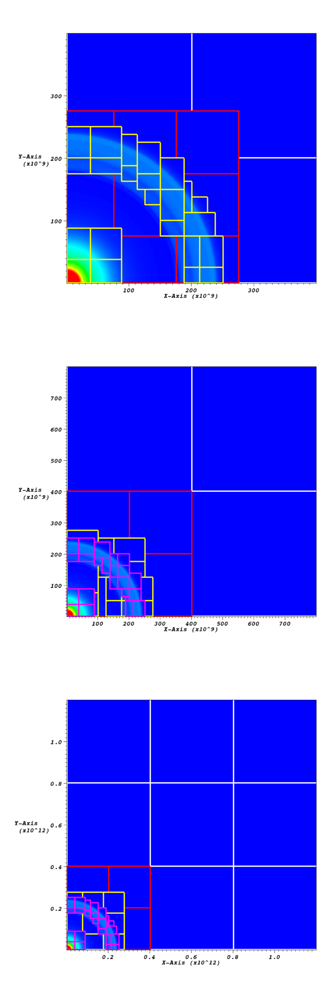
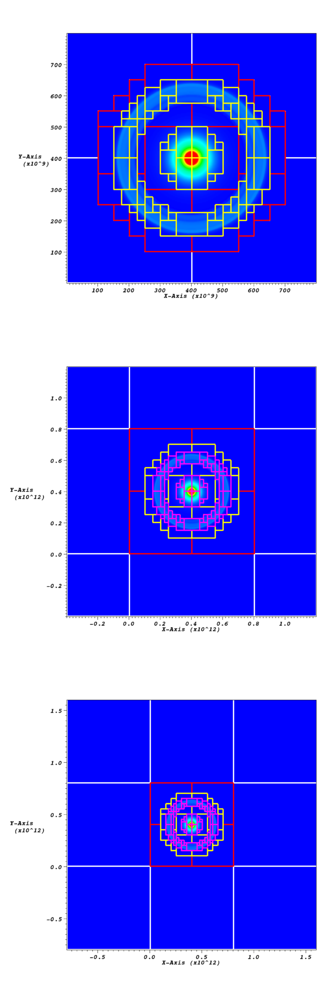

*********************
Checkpoint Embiggener
*********************

Within the Castro distribution, there is the capability to “grow” a
checkpoint file so that a calculation can be restarted in a larger
domain covered by grid cells a factor of two or four coarser than the
existing coarsest level. Instructions for how to do so are in the
``Castro/Util/ConvertCheckpoint/README`` file and are included here.
Upon restart the existing data in the checkpoint file will be used to
fill the region of the previous computational domain, and the new
regions will be filled by some other means, typically interpolation
from a 1D model file.

Star in Corner (``star_at_center`` = 0)
=======================================

In this section we consider the case where the star (or feature of interest)
is centered at the lower left corner of the domain, e.g. you are modeling only one
quarter of the star in 2D, or an octant of the star in 3D. Then you only want
to grow the domain in the “high side” directions (e.g., to the upper right).

Converting the Checkpoint File
------------------------------

Let’s say you have a checkpoint file, ``chk00100`` with 5 levels of
refinement and a (real) problem domain size :math:`P` and (integer)
domain size :math:`D` at level 0.  The inputs file that created this
might have contained::

   max_step = 100
   amr.max_level = 5
   amr.n_cell = D D
   geometry.prob_lo = 0 0
   geometry.prob_hi = P P
   amr.ref_ratio = 4 4 4 4

Now let’s suppose that you want to grow the domain by a factor of 8
and cover that new larger domain with a level that is a factor of 2
coarser than the existing level 0 grids.

#. First, set ``DIM =`` in the GNUmakefile, and type ``make`` in the
   ``Util/ConvertCheckpoint/`` directory.  This will
   make an executable from the ``Embiggen.cpp`` code.

#. Run the embiggening code as follows::

    Embiggen2d.Linux.Intel.Intel.ex checkin=chk00100 checkout=newchk00050 ref_ratio=2 grown_factor=8 star_at_center=0

   (Your executable may have a slightly different name depending on the compilers you
   built it with.)

   This will create a new checkpoint directory, called
   ``newchk00050``, that represents a simulation with *one* additional
   level of refinement *coarser* than the previous level 0 grids by a
   factor of ``ref_ratio`` (in this case, 2).  The new domain will be a
   factor of ``grown_factor`` (in this case, 8) larger than the previous
   domain.

   .. note:: ``ref_ratio`` must be 2 or 4, because those are the only
      acceptable values in Castro.

   ``grown_factor`` can be any reasonable integer; but it’s only been
   tested with 2, 3, 4 and 8. It does not need to be a multiple of 2.

Restarting from a Grown Checkpoint File
---------------------------------------

You should now be able to restart your calculation using ``newchk00050``.
Your inputs file should now contain lines like::

   max_step = 51
   amr.restart = newchk00050
   amr.max_level = 6
   amr.n_cell = 4D 4D
   geometry.prob_lo = 0 0
   geometry.prob_hi = 8P 8P
   castro.grown_factor = 8
   castro.star_at_center = 0
   amr.ref_ratio = 2 4 4 4 4

Important:

 * Unlike earlier, you may now set ``amr.max_level`` to be at most one
   greater than before, but you need not set it that high. For
   example, you could set ``amr.max_level`` the same as before and you
   would lose data at the finest refinement level. You may not set
   ``amr.max_level`` = 0, however, because we have no data at the new
   level 0 until we average down from the new level 1 after the
   restart.

 * You must set ``amr.n_cell`` = (``grown_factor`` / ``ref_ratio``)
   :math:`\times` (the previous value of ``amr.n_cell``). In this case
   ``amr.n_cell`` = (8/2)*D = 4D.

 * You must set ``amr.prob_hi`` to be a factor of ``grown_factor``
   greater than the previous value of ``amr.prob_hi``.

 * You must insert the value of ``ref_ratio`` used in the Embiggen
   call as the first value in the list of ``amr.ref_ratio``, since
   that will now be the refinement ratio between the new level 0 and
   the new level 1.

 * You must set ``castro.grown_factor`` in your inputs file equal to
   the value of ``grown_factor`` you used when you called Embiggen*ex
   so that Castro knows how big the original domain was.

 * Note that if you have run 100 steps at the original level 0, that
   would be equivalent to 50 steps at the new level 0 because you
   coarsened by a factor of 2.  Thus once you re-start from the new
   checkpoint directory, the next step will be 51, not 101. Make sure
   to keep track of your plotfiles accordingly.

 * Don’t forget to adjust ``max_denerr_lev`` and comparable variables
   to control the number of fine levels you now want. If you want to
   have 6 levels of refinement after restart, then make sure
   ``max_denerr_lev``, etc, are set high enough. If you only want to have
   5 levels of refinement (where the new level 5 would now be a factor
   of ``ref_ratio`` coarser than the previous level 5), make sure to
   adjust ``max_denerr_lev`` accordingly as well.

Star at Center of Domain (``star_at_center`` = 1)
=================================================

Now let’s assume that the star (or feature of interest) is centered at
the center of the domain in 2D or 3D Cartesian coordinates. We will
later consider the case of 2D cylindrical (r-z) coordinates in which
the star is centered at the left midpoint.

.. _converting-the-checkpoint-file-1:

Converting the Checkpoint File
------------------------------

Suppose that you want to grow the domain by a factor of 2 and cover
that new larger domain with a level that is a factor of 2 coarser than
the existing level 0 grids.

After you build the Embiggen executable, you type::

  Embiggen2d.Linux.Intel.Intel.ex checkin=chk00100 checkout=newchk00050 ref_ratio=2 grown_factor=2 star_at_center=1

Note that

-  ``ref_ratio`` must still be 2 or 4

-  ``grown_factor`` can only be 2 or 3 in this case.

.. _restarting-from-a-grown-checkpoint-file-1:

Restarting from a Grown Checkpoint File
---------------------------------------

Your inputs file for restarting would now look like::

   max_step = 51
   amr.restart = newchk00050
   amr.max_level = 6
   amr.n_cell = D D
   geometry.prob_lo = -P/2 -P/2
   geometry.prob_hi = 3P/2 3P/2
   castro.grown_factor = 2
   castro.star_at_center = 1
   amr.ref_ratio = 2 4 4 4 4

Cylindrical Coordinates
-----------------------

In the case of 2D cylindrical (r-z) coordinates in which the star is
centered at the left edge but vertical midpoint of the domain, the
embiggening procedure is the same as above (with ``star_at_center`` =
1) but the inputs file for restart is slightly different in that
``geometry.prob_lo`` is modified in the z- but not the r-direction. If
we consider the original inputs file to look like::

   max_step = 100
   amr.max_level = 6
   amr.n_cell = D 2D
   geometry.prob_lo = 0 0
   geometry.prob_hi = P 2P
   amr.ref_ratio = 4 4 4 4

then an inputs file for restart would look like::

   amr.restart = newchk00050
   amr.max_level = 6
   amr.n_cell = D 2D
   geometry.prob_lo = 0 -P
   geometry.prob_hi = 2P 3P
   castro.grown_factor = 2
   castro.star_at_center = 1
   amr.ref_ratio = 2 4 4 4 4

Some results:

   Data from checkpoint file before and after the domain has been
   coarsened and grown. This case uses ``star_at_center`` = 0 and
   ``ref_ratio`` = 2. The first grown example has ``grown_factor`` =
   2, the second has ``grown_factor`` = 3. In all figures the level 0
   grids are shown in white, the level 1 grids in red, the level 2
   grids in yellow, and in the grown figures, the level 3 grids are in
   pink.

   Data from checkpoint file before and after the domain has been
   coarsened and grown. This case uses ``star_at_center`` = 1 and
   ``ref_ratio`` = 2. The first grown example has ``grown_factor`` =
   2, the second has ``grown_factor`` = 3. In all figures the level 0
   grids are shown in white, the level 1 grids in red, the level 2
   grids in yellow, and in the grown figures, the level 3 grids are in
   pink.

