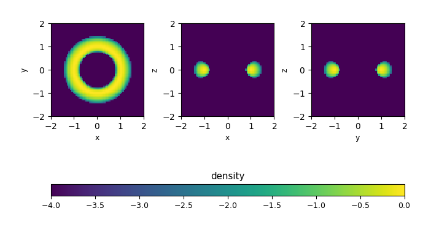
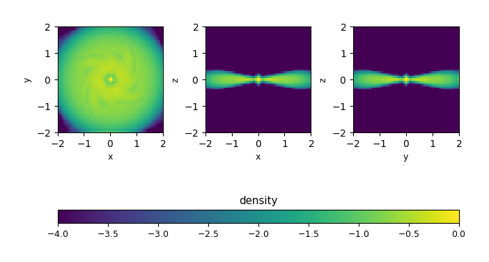
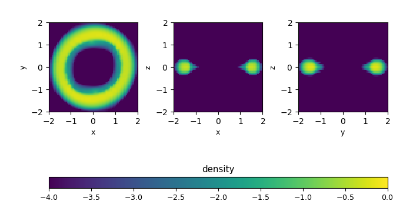

.. _ch:hydro:

*************
Hydrodynamics
*************

Introduction
============

The hydrodynamics scheme in Castro implements an unsplit
second-order Godunov method. Characteristic tracing is used to
time-center the input states to the Riemann solver. The same
hydrodynamics routines are used for pure hydro and radiation
hydrodynamics.

Some general notes:

-  Regardless of the dimensionality, we always carry around all 3
   components of velocity/momentum—this allows for rotation sources easily.

-  When radiation is enabled (via RADIATION), we discuss
   the gas and radiation quantities separately. This generally applies
   to the temperature, pressure, internal energy, various adiabatic
   indices, and sound speed. When we refer to the “total” value of
   one of these, it means that both gas and radiation contributions
   are included. When we refer to the “gas” quantity, this is what
   the equation of state would return.

   For continuity, we continue to use the “gas” qualifier even if we
   are not solving the radiation hydrodynamics equations. In this
   case, it still means that it comes through the equation of state,
   but note some of our equations of state (like the helmeos) include a
   radiation pressure contribution when we are running without
   radiation hydrodynamics enabled. In this case, we still refer to
   this as the “gas”.

Hydrodynamics Data Structures
=============================

Within the routines that implement the hydrodynamics, there are
several main data structures that hold the state.

-  conserved state: these arrays generally begin with ``u``,
   e.g., ``uin``, ``uout``. The ``NUM_STATE``
   components for the state data in the array are accessed using
   integer keys defined in :numref:`table:consints`.

   .. _table:consints:
   .. table:: The integer variables to index the conservative state array

      +-----------------------+-----------------------+-------------------------+
      | **variable**          | **quantity**          | **note**                |
      +=======================+=======================+=========================+
      | ``URHO``              | :math:`\rho`          |                         |
      +-----------------------+-----------------------+-------------------------+
      | ``UMX``               | :math:`\rho u`        |                         |
      +-----------------------+-----------------------+-------------------------+
      | ``UMY``               | :math:`\rho v`        |                         |
      +-----------------------+-----------------------+-------------------------+
      | ``UMZ``               | :math:`\rho w`        |                         |
      +-----------------------+-----------------------+-------------------------+
      | ``UEDEN``             | :math:`\rho E`        |                         |
      +-----------------------+-----------------------+-------------------------+
      | ``UEINT``             | :math:`\rho e`        | this is computed from   |
      |                       |                       | the other quantities    |
      |                       |                       | using                   |
      |                       |                       | :math:`\rho e = \rho    |
      |                       |                       | E - \rho |\ub|^2        |
      |                       |                       | / 2`                    |
      +-----------------------+-----------------------+-------------------------+
      | ``UTEMP``             | :math:`T`             | this is computed from   |
      |                       |                       | the other quantities    |
      |                       |                       | using the EOS           |
      +-----------------------+-----------------------+-------------------------+
      | ``UFA``               | :math:`\rho A_1`      | the first advected      |
      |                       |                       | quantity                |
      +-----------------------+-----------------------+-------------------------+
      | ``UFS``               | :math:`\rho X_1`      | the first species       |
      +-----------------------+-----------------------+-------------------------+
      | ``UFX``               | :math:`\rho Y_1`      | the first auxiliary     |
      |                       |                       | variable                |
      +-----------------------+-----------------------+-------------------------+
      | ``USHK``              | a shock flag          | (used for shock         |
      |                       |                       | detection)              |
      +-----------------------+-----------------------+-------------------------+
      | ``UMR``               | radial momentum       | (if ``HYBRID_MOMENTUM`` |
      |                       |                       | is defined)             |
      +-----------------------+-----------------------+-------------------------+
      | ``UML``               | angular momentum      | (if ``HYBRID_MOMENTUM`` |
      |                       |                       | is defined)             |
      +-----------------------+-----------------------+-------------------------+
      | ``UMP``               | vertical momentum     | (if ``HYBRID_MOMENTUM`` |
      |                       |                       | is defined)             |
      +-----------------------+-----------------------+-------------------------+

-  primitive variable state: these arrays generally simply called
   ``q``, and has ``NQ`` components.

   A related quantity is ``NQSRC`` which is the number of primitive variable
   source terms.  ``NQSRC`` ≤ ``NQ``.

   .. note:: if ``RADIATION`` is defined, then only the gas/hydro terms are
      present in ``NQSRC``.

   :numref:`table:primlist` gives the names of the primitive variable integer
   keys for accessing these arrays. Note, unless otherwise specified the quantities without a subscript
   are “gas” only and those with the “tot” subscript are “gas + radiation”.

   .. _table:primlist:
   .. table:: Primitive State Vector Integer Keys

      +-----------------------+------------------------+-----------------------+
      | **variable**          | **quantity**           | **note**              |
      +=======================+========================+=======================+
      | ``QRHO``              | :math:`\rho`           |                       |
      +-----------------------+------------------------+-----------------------+
      | ``QU``                | :math:`u`              |                       |
      +-----------------------+------------------------+-----------------------+
      | ``QV``                | :math:`v`              |                       |
      +-----------------------+------------------------+-----------------------+
      | ``QW``                | :math:`w`              |                       |
      +-----------------------+------------------------+-----------------------+
      | ``QPRES``             | :math:`p`              |                       |
      +-----------------------+------------------------+-----------------------+
      | ``QREINT``            | :math:`\rho e`         |                       |
      +-----------------------+------------------------+-----------------------+
      | ``QTEMP``             | :math:`T`              |                       |
      +-----------------------+------------------------+-----------------------+
      | ``QFA``               | :math:`A_1`            | the first advected    |
      |                       |                        | quantity              |
      +-----------------------+------------------------+-----------------------+
      | ``QFS``               | :math:`X_1`            | the first species     |
      +-----------------------+------------------------+-----------------------+
      | ``QFX``               | :math:`Y_1`            | the first auxiliary   |
      |                       |                        | variable              |
      +-----------------------+------------------------+-----------------------+
      | ``QPTOT``             | :math:`p_\mathrm{tot}` | the total pressure,   |
      |                       |                        | gas + radiation       |
      +-----------------------+------------------------+-----------------------+
      | ``QREITOT``           | :math:`e_\mathrm{tot}` | the total specific    |
      |                       |                        | internal energy, gas  |
      |                       |                        | + radiation           |
      +-----------------------+------------------------+-----------------------+
      | ``QRAD``              | :math:`E_r`            | the radiation energy  |
      |                       |                        | (there are ngroups of |
      |                       |                        | these)                |
      +-----------------------+------------------------+-----------------------+

-  auxiliary primitive variables: these arrays are generally called
   qaux. The main difference between these and the regular
   primitive variables is that we do not attempt to do any
   reconstruction on their profiles. There are ``NQAUX`` quantities, indexed
   by the integer keys listed in :numref:`table:qauxlist`.
   Note, unless otherwise specified the quantities without a subscript are “gas”
   only and those with the “tot” subscript are “gas + radiation”.

   .. _table:qauxlist:
   .. table:: The integer variable keys for accessing the auxiliary primitive state vector, quax.

      +-----------------------+-----------------------+-----------------------+
      | **variable**          | **quantity**          | **note**              |
      +=======================+=======================+=======================+
      | ``QGAMC``             | :math:`\gamma_1`      | the first adiabatic   |
      |                       |                       | exponent, as returned |
      |                       |                       | from the EOS          |
      +-----------------------+-----------------------+-----------------------+
      | ``QC``                | :math:`c_s`           | the sound speed, as   |
      |                       |                       | returned from the EOS |
      +-----------------------+-----------------------+-----------------------+
      | ``QGAMCG``            | :math:`{\Gamma_1      | includes radiation    |
      |                       | }_\mathrm{tot}`       | components (defined   |
      |                       |                       | only if ``RADIATION`` |
      |                       |                       | is defined)           |
      +-----------------------+-----------------------+-----------------------+
      | ``QCG``               | :math:`{c_s           | total sound speed     |
      |                       | }_\mathrm{tot}`       | including radiation   |
      |                       |                       | (defined only if      |
      |                       |                       | ``RADIATION`` is      |
      |                       |                       | defined)              |
      +-----------------------+-----------------------+-----------------------+
      | ``QLAMS``             | :math:`\lambda_f`     | the ``ngroups`` flux  |
      |                       |                       | limiters (defined     |
      |                       |                       | only if ``RADIATION`` |
      |                       |                       | is defined)           |
      +-----------------------+-----------------------+-----------------------+

-  interface variables: these are the time-centered interface states
   returned by the Riemann solver. They are used to discretize some
   non-conservative terms in the equations. These arrays are generally
   called ``q1``, ``q2``, and ``q3`` for the x, y, and z
   interfaces respectively. There are ``NGDNV`` components accessed with
   the integer keys defined in :numref:`table:gdlist`
   Note, unless otherwise specified the quantities without a subscript are
   “gas” only and those with the “tot” subscript are “gas + radiation”.

   .. _table:gdlist:
   .. table:: The integer variable keys for accessing the Godunov interface state vectors.

      +-----------------------+-----------------------+-----------------------+
      | **variable**          | **quantity**          | **note**              |
      +=======================+=======================+=======================+
      | ``GDRHO``             | :math:`\rho`          |                       |
      +-----------------------+-----------------------+-----------------------+
      | ``GDU``               | :math:`u`             |                       |
      +-----------------------+-----------------------+-----------------------+
      | ``GDV``               | :math:`v`             |                       |
      +-----------------------+-----------------------+-----------------------+
      | ``GDW``               | :math:`w`             |                       |
      +-----------------------+-----------------------+-----------------------+
      | ``GDPRES``            | :math:`p`             | regardless of whether |
      |                       |                       | ``RADIATION`` is      |
      |                       |                       | defined,              |
      |                       |                       | this is always just   |
      |                       |                       | the gas pressure      |
      +-----------------------+-----------------------+-----------------------+
      | ``GDLAMS``            | :math:`{\lambda_f}`   | the starting index    |
      |                       |                       | for the flux          |
      |                       |                       | limiter—there are     |
      |                       |                       | ngroups components    |
      |                       |                       | (defined only if      |
      |                       |                       | ``RADIATION`` is      |
      |                       |                       | defined)              |
      +-----------------------+-----------------------+-----------------------+
      | ``GDERADS``           | :math:`E_r`           | the starting index    |
      |                       |                       | for the radiation     |
      |                       |                       | energy—there are      |
      |                       |                       | ngroups components    |
      |                       |                       | (defined only if      |
      |                       |                       | ``RADIATION`` is      |
      |                       |                       | defined)              |
      +-----------------------+-----------------------+-----------------------+

Conservation Forms
==================

We begin with the fully compressible equations for the conserved state vector,
:math:`\Ub = (\rho, \rho \ub, \rho E, \rho A_k, \rho X_k, \rho Y_k):`

.. math::

   \begin{align}
   \frac{\partial \rho}{\partial t} &= - \nabla \cdot (\rho \ub) + S_{{\rm ext},\rho}, \\
   \frac{\partial (\rho \ub)}{\partial t} &= - \nabla \cdot (\rho \ub \ub) - \nabla p +\rho \gb + \Sb_{{\rm ext},\rho\ub}, \\
   \frac{\partial (\rho E)}{\partial t} &= - \nabla \cdot (\rho \ub E + p \ub) + \rho \ub \cdot \gb - \sum_k {\rho q_k \dot\omega_k} + \nabla\cdot\kth\nabla T + S_{{\rm ext},\rho E}, \\
   \frac{\partial (\rho A_k)}{\partial t} &= - \nabla \cdot (\rho \ub A_k) + S_{{\rm ext},\rho A_k}, \\
   \frac{\partial (\rho X_k)}{\partial t} &= - \nabla \cdot (\rho \ub X_k) + \rho \dot\omega_k + S_{{\rm ext},\rho X_k}, \\
   \frac{\partial (\rho Y_k)}{\partial t} &= - \nabla \cdot (\rho \ub Y_k) + S_{{\rm ext},\rho Y_k}.\label{eq:compressible-equations}
   \end{align}

Here :math:`\rho, \ub, T, p`, and :math:`\kth` are the density,
velocity, temperature, pressure, and thermal conductivity,
respectively, and :math:`E = e + \ub \cdot \ub / 2` is the total
energy with :math:`e` representing the internal energy. In addition,
:math:`X_k` is the abundance of the :math:`k^{\rm th}` isotope, with
associated production rate, :math:`\dot\omega_k`, and energy release,
:math:`q_k`. Here :math:`\gb` is the gravitational vector, and
:math:`S_{{\rm ext},\rho}, \Sb_{{\rm ext}\rho\ub}`, etc., are
user-specified source terms. :math:`A_k` is an advected quantity,
i.e., a tracer. We also carry around auxiliary variables, :math:`Y_k`,
which have a user-defined evolution equation, but by default are
treated as advected quantities.  These are meant to be defined in the network.

In the code we also carry around :math:`T` and :math:`\rho e` in the conservative
state vector even though they are derived from the other conserved
quantities. The ordering of the elements within :math:`\Ub` is defined
by integer variables into the array—see
:numref:`table:consints`.

Some notes:

-  Regardless of the dimensionality of the problem, we always carry
   all 3 components of the velocity. This allows for, e.g., 2.5-d
   rotation (advecting the component of velocity out of the plane in
   axisymmetric coordinates).

   You should always initialize all velocity components to zero, and
   always construct the kinetic energy with all three velocity components.

-  There are ``NADV`` advected quantities, which range from
   ``UFA: UFA+nadv-1``. The advected quantities have no effect at all on
   the rest of the solution but can be useful as tracer quantities.

-  There are ``NSPEC`` species (defined in the network
   directory), which range from ``UFS: UFS+nspec-1``.

-  There are ``NAUX`` auxiliary variables, from ``UFX:UFX+naux-1``. The
   auxiliary variables are passed into the equation of state routines
   along with the species. An example of an auxiliary variable is the
   electron fraction, :math:`Y_e`, in core collapse simulations.  The
   number and names of the auxiliary variables are defined in the
   network.

Source Terms
============

We now compute explicit source terms for each variable in :math:`\Qb` and
:math:`\Ub`. The primitive variable source terms will be used to construct
time-centered fluxes. The conserved variable source will be used to
advance the solution. We neglect reaction source terms since they are
accounted for in **Steps 1** and **6**. The source terms are:

.. math::

   \Sb_{\Qb}^n =
   \left(\begin{array}{c}
   S_\rho \\
   \Sb_{\ub} \\
   S_p \\
   S_{\rho e} \\
   S_{A_k} \\
   S_{X_k} \\
   S_{Y_k}
   \end{array}\right)^n
   =
   \left(\begin{array}{c}
   S_{{\rm ext},\rho} \\
   \gb + \frac{1}{\rho}\Sb_{{\rm ext},\rho\ub} \\
   \frac{1}{\rho}\frac{\partial p}{\partial e}S_{{\rm ext},\rho E} + \frac{\partial p}{\partial\rho}S_{{\rm ext}\rho} \\
   \nabla\cdot\kth\nabla T + S_{{\rm ext},\rho E} \\
   \frac{1}{\rho}S_{{\rm ext},\rho A_k} \\
   \frac{1}{\rho}S_{{\rm ext},\rho X_k} \\
   \frac{1}{\rho}S_{{\rm ext},\rho Y_k}
   \end{array}\right)^n,

.. math::

   \Sb_{\Ub}^n =
   \left(\begin{array}{c}
   \Sb_{\rho\ub} \\
   S_{\rho E} \\
   S_{\rho A_k} \\
   S_{\rho X_k} \\
   S_{\rho Y_k}
   \end{array}\right)^n
   =
   \left(\begin{array}{c}
   \rho \gb + \Sb_{{\rm ext},\rho\ub} \\
   \rho \ub \cdot \gb + \nabla\cdot\kth\nabla T + S_{{\rm ext},\rho E} \\
   S_{{\rm ext},\rho A_k} \\
   S_{{\rm ext},\rho X_k} \\
   S_{{\rm ext},\rho Y_k}
   \end{array}\right)^n.

.. index:: USE_SPECIES_SOURCES

.. note:: To reduce memory usage, we do not include source terms for the
   advected quantities, species, and auxiliary variables in the conserved
   state vector by default. If your application needs external source terms for
   these variables, set ``USE_SPECIES_SOURCES=TRUE`` when compiling so that space
   will be allocated for them.

Primitive Forms
===============

Castro uses the primitive form of the fluid equations, defined in terms of
the state :math:`\Qb = (\rho, \ub, p, \rho e, A_k, X_k, Y_k)`, to construct the
interface states that are input to the Riemann problem.

The primitive variable equations for density, velocity, and pressure are:

.. math::

   \begin{align}
     \frac{\partial\rho}{\partial t} &= -\ub\cdot\nabla\rho - \rho\nabla\cdot\ub + S_{{\rm ext},\rho} \\
   %
     \frac{\partial\ub}{\partial t} &= -\ub\cdot\nabla\ub - \frac{1}{\rho}\nabla p + \gb +
   \frac{1}{\rho} (\Sb_{{\rm ext},\rho\ub} - \ub \; S_{{\rm ext},\rho}) \\
   \frac{\partial p}{\partial t} &= -\ub\cdot\nabla p - \rho c^2\nabla\cdot\ub +
   \left(\frac{\partial p}{\partial \rho}\right)_{e,X}S_{{\rm ext},\rho}\nonumber\\
   &+\  \frac{1}{\rho}\sum_k\left(\frac{\partial p}{\partial X_k}\right)_{\rho,e,X_j,j\neq k}\left(\rho\dot\omega_k + S_{{\rm ext},\rho X_k} - X_kS_{{\rm ext},\rho}\right)\nonumber\\
   & +\  \frac{1}{\rho}\left(\frac{\partial p}{\partial e}\right)_{\rho,X}\left[-eS_{{\rm ext},\rho} - \sum_k\rho q_k\dot\omega_k + \nabla\cdot\kth\nabla T \right.\nonumber\\
   & \quad\qquad\qquad\qquad+\ S_{{\rm ext},\rho E} - \ub\cdot\left(\Sb_{{\rm ext},\rho\ub} - \frac{\ub}{2}S_{{\rm ext},\rho}\right)\Biggr]
   \end{align}

The advected quantities appear as:

.. math::

   \begin{align}
   \frac{\partial A_k}{\partial t} &= -\ub\cdot\nabla A_k + \frac{1}{\rho}
                                        ( S_{{\rm ext},\rho A_k} - A_k S_{{\rm ext},\rho} ), \\
   \frac{\partial X_k}{\partial t} &= -\ub\cdot\nabla X_k + \dot\omega_k + \frac{1}{\rho}
                                        ( S_{{\rm ext},\rho X_k}  - X_k S_{{\rm ext},\rho} ), \\
   \frac{\partial Y_k}{\partial t} &= -\ub\cdot\nabla Y_k + \frac{1}{\rho}
                                        ( S_{{\rm ext},\rho Y_k}  - Y_k S_{{\rm ext},\rho} ).
   \end{align}

All of the primitive variables are derived from the conservative state
vector, as described in Section `6.1 <#Sec:Compute Primitive Variables>`__.
When accessing the primitive variable state vector, the integer variable
keys for the different quantities are listed in :numref:`table:primlist`.

Internal energy and temperature
-------------------------------

We augment the above system with an internal energy equation:

.. math::

   \begin{align}
   \frac{\partial(\rho e)}{\partial t} &= - \ub\cdot\nabla(\rho e) - (\rho e+p)\nabla\cdot\ub - \sum_k \rho q_k\dot\omega_k
                                           + \nabla\cdot\kth\nabla T + S_{{\rm ext},\rho E} \nonumber\\
   & -\  \ub\cdot\left(\Sb_{{\rm ext},\rho\ub}-\frac{1}{2}S_{{\rm ext},\rho}\ub\right),
   \end{align}

This has two benefits. First, for a general equation of state,
carrying around an additional thermodynamic quantity allows us to
avoid equation of state calls (in particular, in the Riemann solver,
see e.g. :cite:`colglaz`). Second, it is sometimes the case that the
internal energy calculated as

.. math:: e_T \equiv E - \frac{1}{2} \mathbf{v}^2

is
unreliable. This has two usual causes: one, for high Mach number
flows, the kinetic energy can dominate the total gas energy, making
the subtraction numerically unreliable; two, if you use gravity or
other source terms, these can indirectly alter the value of the
internal energy if obtained from the total energy.

To provide a more reasonable internal energy for defining the
thermodynamic state, we have implemented the dual energy formalism
from ENZO :cite:`bryan:1995`, :cite:`bryan:2014`, where we switch
between :math:`(\rho e)` and :math:`(\rho e_T)` depending on the local
state of the fluid. To do so, we define parameters :math:`\eta_1`,
:math:`\eta_2`, and :math:`\eta_3`, corresponding to the code
parameters castro.dual_energy_eta1, castro.dual_energy_eta2, and
castro.dual_energy_eta3. We then consider the ratio :math:`e_T / E`,
the ratio of the internal energy (derived from the total energy) to
the total energy. These parameters are used as follows:

-  :math:`\eta_1`: If :math:`e_T > \eta_1 E`, then we use :math:`e_T` for the purpose
   of calculating the pressure in the hydrodynamics update. Otherwise,
   we use the :math:`e` from the internal energy equation in our EOS call to
   get the pressure.

-  :math:`\eta_2`: At the end of each hydro advance, we examine whether
   :math:`e_T > \eta_2 E`. If so, we reset :math:`e` to be equal to :math:`e_T`,
   discarding the results of the internal energy equation. Otherwise,
   we keep :math:`e` as it is.

-  :math:`\eta_3`: Similar to :math:`\eta_1`, if :math:`e_T > \eta_3 E`, we use
   :math:`e_T` for the purposes of our nuclear reactions, otherwise, we use
   :math:`e`.

Note that our version of the internal energy equation does not require
an artificial viscosity, as used in some other hydrodynamics
codes. The update for :math:`(\rho e)` uses information from the Riemann
solve to calculate the fluxes, which contains the information
intrinsic to the shock-capturing part of the scheme.

In the code we also carry around :math:`T` in the primitive state vector.

Primitive Variable System
-------------------------

The full primitive variable form (without the advected or auxiliary
quantities) is

.. math:: \frac{\partial\Qb}{\partial t} + \sum_d \Ab_d\frac{\partial\Qb}{\partial x_d} = \Sb_{\Qb}.

For example, in 2D:

.. math::

   \left(\begin{array}{c}
   \rho \\
   u \\
   v \\
   p \\
   \rho e \\
   X_k
   \end{array}\right)_t
   +
   \left(\begin{array}{cccccc}
   u & \rho & 0 & 0 & 0 & 0 \\
   0 & u & 0 & \frac{1}{\rho} & 0 & 0 \\
   0 & 0 & u & 0 & 0 & 0 \\
   0 & \rho c^2 & 0 & u & 0 & 0 \\
   0 & \rho e + p & 0 & 0 & u & 0 \\
   0 & 0 & 0 & 0 & 0 & u
   \end{array}\right)
   \left(\begin{array}{c}
   \rho \\
   u \\
   v \\
   p \\
   \rho e \\
   X_k
   \end{array}\right)_x
   +
   \left(\begin{array}{cccccc}
   v & 0 & \rho & 0 & 0 & 0 \\
   0 & v & 0 & 0 & 0 & 0 \\
   0 & 0 & v & \frac{1}{\rho} & 0 & 0 \\
   0 & 0 & \rho c^2 & v & 0 & 0 \\
   0 & 0 & \rho e + p & 0 & v & 0 \\
   0 & 0 & 0 & 0 & 0 & v
   \end{array}\right)
   \left(\begin{array}{c}
   \rho \\
   u \\
   v \\
   p \\
   \rho e \\
   X_k
   \end{array}\right)_y
   =
   \Sb_\Qb

The eigenvalues are:

.. math:: {\bf \Lambda}(\Ab_x) = \{u-c,u,u,u,u,u+c\}, \qquad {\bf \Lambda}(\Ab_y) = \{v-c,v,v,v,v,v+c\} .

The right column eigenvectors are:

.. math::

   \Rb(\Ab_x) =
   \left(\begin{array}{cccccc}
   1 & 1 & 0 & 0 & 0 & 1 \\
   -\frac{c}{\rho} & 0 & 0 & 0 & 0 & \frac{c}{\rho} \\
   0 & 0 & 1 & 0 & 0 & 0 \\
   c^2 & 0 & 0 & 0 & 0 & c^2 \\
   h & 0 & 0 & 1 & 0 & h \\
   0 & 0 & 0 & 0 & 1 & 0 \\
   \end{array}\right),
   \qquad
   \Rb(\Ab_y) =
   \left(\begin{array}{cccccc}
   1 & 1 & 0 & 0 & 0 & 1 \\
   0 & 0 & 1 & 0 & 0 & 0 \\
   -\frac{c}{\rho} & 0 & 0 & 0 & 0 & \frac{c}{\rho} \\
   c^2 & 0 & 0 & 0 & 0 & c^2 \\
   h & 0 & 0 & 1 & 0 & h \\
   0 & 0 & 0 & 0 & 1 & 0 \\
   \end{array}\right).

The left row eigenvectors, normalized so that :math:`\Rb_d\cdot\Lb_d = \Ib` are:

.. math::

   \Lb_x =
   \left(\begin{array}{cccccc}
   0 & -\frac{\rho}{2c} & 0 & \frac{1}{2c^2} & 0 & 0 \\
   1 & 0 & 0 & -\frac{1}{c^2} & 0 & 0 \\
   0 & 0 & 1 & 0 & 0 & 0 \\
   0 & 0 & 0 & -\frac{h}{c^2} & 1 & 0 \\
   0 & 0 & 0 & 0 & 0 & 1 \\
   0 & \frac{\rho}{2c} & 0 & \frac{1}{2c^2} & 0 & 0
   \end{array}\right),
   \qquad
   \Lb_y =
   \left(\begin{array}{cccccc}
   0 & 0 & -\frac{\rho}{2c} & \frac{1}{2c^2} & 0 & 0 \\
   1 & 0 & 0 & -\frac{1}{c^2} & 0 & 0 \\
   0 & 1 & 0 & 0 & 0 & 0 \\
   0 & 0 & 0 & -\frac{h}{c^2} & 1 & 0 \\
   0 & 0 & 0 & 0 & 0 & 1 \\
   0 & 0 & \frac{\rho}{2c} & \frac{1}{2c^2} & 0 & 0
   \end{array}\right).

.. _Sec:Advection Step:

Hydrodynamics Update
====================

There are four major steps in the hydrodynamics update:

#. Converting to primitive variables

#. Construction the edge states

#. Solving the Riemann problem

#. Doing the conservative update

.. index:: castro.do_hydro, castro.add_ext_src, castro.do_sponge, castro.normalize_species

Each of these steps has a variety of runtime parameters that
affect their behavior. Additionally, there are some general
runtime parameters for hydrodynamics:

-  ``castro.do_hydro``: time-advance the fluid dynamical
   equations (0 or 1; must be set)

-  ``castro.add_ext_src``: include additional user-specified
   source term (0 or 1; default 0)

-  ``castro.do_sponge``: call the sponge routine
   after the solution update (0 or 1; default: 0)

   See :ref:`sponge_section` for more details on the sponge.

.. index:: castro.small_dens, castro.small_temp, castro.small_pres

Several floors are imposed on the thermodynamic quantities to prevet unphysical
behavior:

-  ``castro.small_dens``: (Real; default: -1.e20)

-  ``castro.small_temp``: (Real; default: -1.e20)

-  ``castro.small_pres``: (Real; default: -1.e20)

.. _Sec:Compute Primitive Variables:

Compute Primitive Variables
---------------------------

We compute the primitive variables from the conserved variables.

-  :math:`\rho, \rho e`: directly copy these from the conserved state
   vector

-  :math:`\ub, A_k, X_k, Y_k`: copy these from the conserved state
   vector, dividing by :math:`\rho`

-  :math:`p,T`: use the EOS.

   First, we use the EOS to ensure :math:`e` is no smaller than :math:`e(\rho,T_{\rm small},X_k)`.
   Then we use the EOS to compute :math:`p,T = p,T(\rho,e,X_k)`.

We also compute the flattening coefficient, :math:`\chi\in[0,1]`, used in
the edge state prediction to further limit slopes near strong shocks.
We use the same flattening procedure described in the the the original
PPM paper :cite:`ppm` and the Flash paper :cite:`flash`.
A flattening coefficient of 1 indicates that no additional limiting
takes place; a flattening coefficient of 0 means we effectively drop
order to a first-order Godunov scheme (this convention is opposite of
that used in the Flash paper). For each cell, we compute the
flattening coefficient for each spatial direction, and choose the
minimum value over all directions. As an example, to compute the
flattening for the x-direction, here are the steps:

#. Define :math:`\zeta`

   .. math:: \zeta_i = \frac{p_{i+1}-p_{i-1}}{\max\left(p_{\rm small},|p_{i+2}-p_{i-2}|\right)}.

#. Define :math:`\tilde\chi`

   .. math:: \tilde\chi_i = \min\left\{1,\max[0,a(\zeta_i - b)]\right\},

   where :math:`a=10` and :math:`b=0.75` are tunable parameters. We are essentially
   setting :math:`\tilde\chi_i=a(\zeta_i-b)`, and then constraining
   :math:`\tilde\chi_i` to lie in the range :math:`[0,1]`. Then, if either
   :math:`u_{i+1}-u_{i-1}<0` or

   .. math:: \frac{p_{i+1}-p_{i-1}}{\min(p_{i+1},p_{i-1})} \le c,

   where :math:`c=1/3` is a tunable parameter, then set :math:`\tilde\chi_i=0`.

#. Define :math:`\chi`

   .. math::

      \chi_i =
      \begin{cases}
      1 - \max(\tilde\chi_i,\tilde\chi_{i-1}) & p_{i+1}-p_{i-1} > 0 \\
      1 - \max(\tilde\chi_i,\tilde\chi_{i+1}) & \text{otherwise}
      \end{cases}.

The following runtime parameters affect the behavior here:

-  castro.use_flattening turns on/off the flattening of parabola
   near shocks (0 or 1; default 1)

Edge State Prediction
---------------------

We wish to compute a left and right state of primitive variables at
each edge to be used as inputs to the Riemann problem. There
are several reconstruction techniques, a piecewise
linear method that follows the description in :cite:`colella:1990`,
the classic PPM limiters :cite:`ppm`, and the new PPM limiters introduced
in :cite:`colellasekora`. The choice of
limiters is determined by castro.ppm_type.

For the new PPM limiters, we have further modified the method
of :cite:`colellasekora` to eliminate sensitivity due to roundoff error
(modifications via personal communication with Colella).

We also use characteristic tracing with corner coupling in 3D, as
described in Miller & Colella (2002) :cite:`millercolella:2002`. We
give full details of the new PPM algorithm, as it has not appeared before
in the literature, and summarize the developments from Miller &
Colella.

The PPM algorithm is used to compute time-centered edge states by
extrapolating the base-time data in space and time. The edge states
are dual-valued, i.e., at each face, there is a left state and a right
state estimate. The spatial extrapolation is one-dimensional, i.e.,
transverse derivatives are ignored. We also use a flattening
procedure to further limit the edge state values. The Miller &
Colella algorithm, which we describe later, incorporates the
transverse terms, and also describes the modifications required for
equations with additional characteristics besides the fluid velocity.
There are four steps to compute these dual-valued edge states (here,
we use :math:`s` to denote an arbitrary scalar from :math:`\Qb`, and we write the
equations in 1D, for simplicity):

-  **Step 1**: Compute :math:`s_{i,+}` and :math:`s_{i,-}`, which are spatial
   interpolations of :math:`s` to the hi and lo side of the face with special
   limiters, respectively. Begin by interpolating :math:`s` to edges using a
   4th-order interpolation in space:

   .. math:: s_{i+\myhalf} = \frac{7}{12}\left(s_{i+1}+s_i\right) - \frac{1}{12}\left(s_{i+2}+s_{i-1}\right).

   Then, if :math:`(s_{i+\myhalf}-s_i)(s_{i+1}-s_{i+\myhalf}) < 0`, we limit
   :math:`s_{i+\myhalf}` a nonlinear combination of approximations to the
   second derivative. The steps are as follows:

   #. Define:

      .. math::

         \begin{align}
         (D^2s)_{i+\myhalf} &= 3\left(s_{i}-2s_{i+\myhalf}+s_{i+1}\right) \\
         (D^2s)_{i+\myhalf,L} &= s_{i-1}-2s_{i}+s_{i+1} \\
         (D^2s)_{i+\myhalf,R} &= s_{i}-2s_{i+1}+s_{i+2}
         \end{align}

   #. Define

      .. math:: s = \text{sign}\left[(D^2s)_{i+\myhalf}\right],

      .. math:: (D^2s)_{i+\myhalf,\text{lim}} = s\max\left\{\min\left[Cs\left|(D^2s)_{i+\myhalf,L}\right|,Cs\left|(D^2s)_{i+\myhalf,R}\right|,s\left|(D^2s)_{i+\myhalf}\right|\right],0\right\},

      where :math:`C=1.25` as used in Colella and Sekora 2009. The limited value
      of :math:`s_{i+\myhalf}` is

      .. math:: s_{i+\myhalf} = \frac{1}{2}\left(s_{i}+s_{i+1}\right) - \frac{1}{6}(D^2s)_{i+\myhalf,\text{lim}}.

   Now we implement an updated implementation of the Colella & Sekora
   algorithm which eliminates sensitivity to roundoff. First we
   need to detect whether a particular cell corresponds to an
   “extremum”. There are two tests.

   -  For the first test, define

      .. math:: \alpha_{i,\pm} = s_{i\pm\myhalf} - s_i.

      If :math:`\alpha_{i,+}\alpha_{i,-} \ge 0`, then we are at an extremum.

   -  We only apply the second test if either
      :math:`|\alpha_{i,\pm}| > 2|\alpha_{i,\mp}|`. If so, we define:

      .. math::

         \begin{align}
         (Ds)_{i,{\rm face},-} &= s_{i-1/2} - s_{i-3/2} \\
         (Ds)_{i,{\rm face},+} &= s_{i+3/2} - s_{i-1/2}
         \end{align}

      .. math:: (Ds)_{i,{\rm face,min}} = \min\left[\left|(Ds)_{i,{\rm face},-}\right|,\left|(Ds)_{i,{\rm face},+}\right|\right].

      .. math::

         \begin{align}
         (Ds)_{i,{\rm cc},-} &= s_{i} - s_{i-1} \\
         (Ds)_{i,{\rm cc},+} &= s_{i+1} - s_{i}
         \end{align}

      .. math:: (Ds)_{i,{\rm cc,min}} = \min\left[\left|(Ds)_{i,{\rm cc},-}\right|,\left|(Ds)_{i,{\rm cc},+}\right|\right].

      If :math:`(Ds)_{i,{\rm face,min}} \ge (Ds)_{i,{\rm cc,min}}`, set
      :math:`(Ds)_{i,\pm} = (Ds)_{i,{\rm face},\pm}`. Otherwise, set
      :math:`(Ds)_{i,\pm} = (Ds)_{i,{\rm cc},\pm}`. Finally, we are at an extreumum if
      :math:`(Ds)_{i,+}(Ds)_{i,-} \le 0`.

   Thus concludes the extremum tests. The remaining limiters depend on
   whether we are at an extremum.

   -  If we are at an extremum, we modify :math:`\alpha_{i,\pm}`. First, we
      define

      .. math::

         \begin{align}
         (D^2s)_{i} &= 6(\alpha_{i,+}+\alpha_{i,-}) \\
         (D^2s)_{i,L} &= s_{i-2}-2s_{i-1}+s_{i} \\
         (D^2s)_{i,R} &= s_{i}-2s_{i+1}+s_{i+2} \\
         (D^2s)_{i,C} &= s_{i-1}-2s_{i}+s_{i+1}
         \end{align}

      Then, define

      .. math:: s = \text{sign}\left[(D^2s)_{i}\right],

      .. math:: (D^2s)_{i,\text{lim}} = \max\left\{\min\left[s(D^2s)_{i},Cs\left|(D^2s)_{i,L}\right|,Cs\left|(D^2s)_{i,R}\right|,Cs\left|(D^2s)_{i,C}\right|\right],0\right\}.

      Then,

      .. math:: \alpha_{i,\pm} = \frac{\alpha_{i,\pm}(D^2s)_{i,\text{lim}}}{\max\left[(D^2s)_{i},1\times 10^{-10}\right]}

   -  If we are not at an extremum and
      :math:`|\alpha_{i,\pm}| > 2|\alpha_{i,\mp}|`, then define

      .. math:: s = \text{sign}(\alpha_{i,\mp})

      .. math:: \delta\mathcal{I}_{\text{ext}} = \frac{-\alpha_{i,\pm}^2}{4\left(\alpha_{j,+}+\alpha_{j,-}\right)},

      .. math:: \delta s = s_{i\mp 1} - s_i,

      If :math:`s\delta\mathcal{I}_{\text{ext}} \ge s\delta s`, then we perform
      the following test. If :math:`s\delta s - \alpha_{i,\mp} \ge 1\times
      10^{-10}`, then

      .. math:: \alpha_{i,\pm} =  -2\delta s - 2s\left[(\delta s)^2 - \delta s \alpha_{i,\mp}\right]^{\myhalf}

      otherwise,

      .. math:: \alpha_{i,\pm} =  -2\alpha_{i,\mp}

   Finally, :math:`s_{i,\pm} = s_i + \alpha_{i,\pm}`.

-  **Step 2**: Construct a quadratic profile using :math:`s_{i,-},s_i`,
   and :math:`s_{i,+}`.

   .. math::
      s_i^I(x) = s_{i,-} + \xi\left[s_{i,+} - s_{i,-} + s_{6,i}(1-\xi)\right],
      :label: Quadratic Interp

   .. math:: s_6 = 6s_{i} - 3\left(s_{i,-}+s_{i,+}\right),

   .. math:: \xi = \frac{x - ih}{h}, ~ 0 \le \xi \le 1.

-  | **Step 3:** Integrate quadratic profiles. We are essentially
     computing the average value swept out by the quadratic profile
     across the face assuming the profile is moving at a speed
     :math:`\lambda_k`.
   | Define the following integrals, where :math:`\sigma_k =
       |\lambda_k|\Delta t/h`:

     .. math::

        \begin{align}
        \mathcal{I}^{(k)}_{+}(s_i) &= \frac{1}{\sigma_k h}\int_{(i+\myhalf)h-\sigma_k h}^{(i+\myhalf)h}s_i^I(x)dx \\
        \mathcal{I}^{(k)}_{-}(s_i) &= \frac{1}{\sigma_k h}\int_{(i-\myhalf)h}^{(i-\myhalf)h+\sigma_k h}s_i^I(x)dx
        \end{align}

     Plugging in :eq:`Quadratic Interp` gives:

     .. math::

        \begin{align}
        \mathcal{I}^{(k)}_{+}(s_i) &= s_{i,+} - \frac{\sigma_k}{2}\left[s_{i,+}-s_{i,-}-\left(1-\frac{2}{3}\sigma_k\right)s_{6,i}\right], \\
        \mathcal{I}^{(k)}_{-}(s_i) &= s_{i,-} + \frac{\sigma_k}{2}\left[s_{i,+}-s_{i,-}+\left(1-\frac{2}{3}\sigma_k\right)s_{6,i}\right].
        \end{align}

-  **Step 4:** Obtain 1D edge states by performing a 1D
   extrapolation to get left and right edge states. Note that we
   include an explicit source term contribution.

   .. math::

      \begin{align}
      s_{L,i+\myhalf} &= s_i - \chi_i\sum_{k:\lambda_k \ge 0}\lb_k\cdot\left[s_i-\mathcal{I}^{(k)}_{+}(s_i)\right]\rb_k + \frac{\dt}{2}S_i^n, \\
      s_{R,i-\myhalf} &= s_i - \chi_i\sum_{k:\lambda_k < 0}\lb_k\cdot\left[s_i-\mathcal{I}^{(k)}_{-}(s_i)\right]\rb_k + \frac{\dt}{2}S_i^n.
      \end{align}

   Here, :math:`\rb_k` is the :math:`k^{\rm th}` right column eigenvector of
   :math:`\Rb(\Ab_d)` and :math:`\lb_k` is the :math:`k^{\rm th}` left row eigenvector lf
   :math:`\Lb(\Ab_d)`. The flattening coefficient is :math:`\chi_i`.

In order to add the transverse terms in an spatial operator unsplit
framework, the details follow exactly as given in Section 4.2.1 in
Miller & Colella, except for the details of the Riemann solver,
which are given below.

.. index:: castro.ppm_type

For the reconstruction of the interface states, the following apply:

-  ``castro.ppm_type`` : use piecewise linear vs PPM algorithm (0 or 1;
   default: 1).  A value of 1 is the standard piecewise parabolic
   reconstruction.

-  ``castro.ppm_temp_fix`` does various attempts to use the
   temperature in the reconstruction of the interface states.
   See :ref:`sec-ppm_temp_fix` for an explanation of the allowed options.

The interface states are corrected with information from the
transverse directions to make this a second-order update. These
transverse directions involve separate Riemann solves. Sometimes, the
update to the interface state from the transverse directions can make
the state ill-posed. There are several parameters that help fix this:

-  ``castro.transverse_use_eos`` : If this is 1, then we call
   the equation of state on the interface, using :math:`\rho`, :math:`e`, and
   :math:`X_k`, to get the interface pressure. This should result in a
   thermodynamically consistent interface state.

-  ``castro.transverse_reset_density`` : If the transverse
   corrections result in a negative density on the interface, then we
   reset all of the interface states to their values before the
   transverse corrections.

-  ``castro.transverse_reset_rhoe`` : The transverse updates operate
   on the conserved state. Usually, we construct the interface
   :math:`(\rho e)` in the transverse update from total energy and the
   kinetic energy, however, if the interface :math:`(rho e)` is negative,
   and ``transverse_reset_rhoe`` = 1, then we explicitly
   discretize an equation for the evolution of :math:`(\rho e)`, including
   its transverse update.

Riemann Problem
---------------

Castro has three main options for the Riemann solver—the
Colella & Glaz solver :cite:`colglaz` (the same solver used
by Flash), a simpler solver described in an unpublished
manuscript by Colella, Glaz, & Ferguson, and an HLLC
solver. The first two are both
two-shock approximate solvers, but differ in how they approximate
the thermodynamics in the “star” region.

.. index:: castro.riemann_speed_limit

.. note::

   These Riemann solvers are for Newtonian hydrodynamics, however, we enforce
   that the interface velocity cannot exceed the speed of light in both the
   Colella & Glaz and Colella, Glaz, & Ferguson solvers.  This excessive speed
   usually is a sign of low density regions and density resets or the flux limiter
   kicking in.  This behavior can be changed with the ``castro.riemann_speed_limit``
   parameter.

Inputs from the edge state prediction are :math:`\rho_{L/R}, u_{L/R},
v_{L/R}, p_{L/R}`, and :math:`(\rho e)_{L/R}` (:math:`v` represents all of the
transverse velocity components). We also compute :math:`\Gamma \equiv d\log
p / d\log \rho |_s` at cell centers and copy these to edges directly
to get the left and right states, :math:`\Gamma_{L/R}`. We also define
:math:`c_{\rm avg}` as a face-centered value that is the average of the
neighboring cell-centered values of :math:`c`. We have also computed
:math:`\rho_{\rm small}, p_{\rm small}`, and :math:`c_{\rm small}` using
cell-centered data.

Here are the steps. First, define
:math:`(\rho c)_{\rm small} = \rho_{\rm small}c_{\rm small}`. Then, define:

.. math:: (\rho c)_{L/R} = \max\left[(\rho c)_{\rm small},\left|\Gamma_{L/R},p_{L/R},\rho_{L/R}\right|\right].

Define star states:

.. math:: p^* = \max\left[p_{\rm small},\frac{\left[(\rho c)_L p_R + (\rho c)_R p_L\right] + (\rho c)_L(\rho c)_R(u_L-u_R)}{(\rho c)_L + (\rho c)_R}\right],

.. math:: u^* = \frac{\left[(\rho c)_L u_L + (\rho c)_R u_R\right]+ (p_L - p_R)}{(\rho c)_L + (\rho c)_R}.

If :math:`u^* \ge 0` then define :math:`\rho_0, u_0, p_0, (\rho e)_0` and :math:`\Gamma_0` to be the left state. Otherwise, define them to be the right state. Then, set

.. math:: \rho_0 = \max(\rho_{\rm small},\rho_0),

and define

.. math:: c_0 = \max\left(c_{\rm small},\sqrt{\frac{\Gamma_0 p_0}{\rho_0}}\right),

.. math:: \rho^* = \rho_0 + \frac{p^* - p_0}{c_0^2},

.. math:: (\rho e)^* = (\rho e)_0 + (p^* - p_0)\frac{(\rho e)_0 + p_0}{\rho_0 c_0^2},

.. math:: c^* = \max\left(c_{\rm small},\sqrt{\left|\frac{\Gamma_0 p^*}{\rho^*}\right|}\right)

Then,

.. math::

   \begin{align}
   c_{\rm out} &= c_0 - {\rm sign}(u^*)u_0, \\
   c_{\rm in} &= c^* - {\rm sign}(u^*)u^*, \\
   c_{\rm shock} &= \frac{c_{\rm in} + c_{\rm out}}{2}.
   \end{align}

If :math:`p^* - p_0 \ge 0`, then :math:`c_{\rm in} = c_{\rm out} = c_{\rm shock}`.
Then, if :math:`c_{\rm out} = c_{\rm in}`, we define :math:`c_{\rm temp} =
\epsilon c_{\rm avg}`. Otherwise, :math:`c_{\rm temp} = c_{\rm out} -
c_{\rm in}`. We define the fraction

.. math:: f = \half\left[1 + \frac{c_{\rm out} + c_{\rm in}}{c_{\rm temp}}\right],

and constrain :math:`f` to lie in the range :math:`f\in[0,1]`.

To get the final “Godunov” state, for the transverse velocity, we
upwind based on :math:`u^*`.

.. math::

   v_{\rm gdnv} =
   \begin{cases}
   v_L, & u^* \ge 0 \\
   v_R, & {\rm otherwise}
   \end{cases}.

Then, define

.. math::

   \begin{align}
   \rho_{\rm gdnv} &= f\rho^* + (1-f)\rho_0, \\
   u_{\rm gdnv} &= f u^* + (1-f)u_0, \\
   p_{\rm gdnv} &= f p^* + (1-f)p_0, \\
   (\rho e)_{\rm gdnv} &=& f(\rho e)^* + (1-f)(\rho e)_0.
   \end{align}

Finally, if :math:`c_{\rm out} < 0`, set
:math:`\rho_{\rm gdnv}=\rho_0, u_{\rm gdnv}=u_0, p_{\rm gdnv}=p_0`, and
:math:`(\rho e)_{\rm gdnv}=(\rho e)_0`.
If :math:`c_{\rm in}\ge 0`, set :math:`\rho_{\rm gdnv}=\rho^*, u_{\rm gdnv}=u^*,
p_{\rm gdnv}=p^*`, and :math:`(\rho e)_{\rm gdnv}=(\rho e)^*`.

If instead the Colella & Glaz solver is used, then we define

.. math:: \gamma \equiv \frac{p}{\rho e} + 1

on each side of the interface and follow the rest of the algorithm as
described in the original paper.

For the construction of the fluxes in the Riemann solver, the following
parameters apply:

-  ``castro.riemann_solver``: this can be one of the following values:

   -  0: the Colella, Glaz, & Ferguson solver.

   -  1: the Colella & Glaz solver

   -  2: the HLLC solver.

      .. note::

         HLLC should only be used with Cartesian
         geometries because it relies on the pressure term being part of the flux
         in the momentum equation.

   The default is to use the solver based on an unpublished Colella,
   Glaz, & Ferguson manuscript (it also appears in :cite:`pember:1996`),
   as described in the original Castro paper :cite:`castro_I`.

   The Colella & Glaz solver is iterative, and two runtime parameters are used
   to control its behavior:

   -  ``castro.cg_maxiter`` : number of iterations for CG algorithm
      (Integer; default: 12)

   -  ``castro.cg_tol`` : tolerance for CG solver when solving
      for the “star” state (Real; default: 1.0e-5)

   -  ``castro.cg_blend`` : this controls what happens if the root
      finding in the CG solver fails. There is a nonlinear equation to find
      the pressure in the *star* region from the jump conditions for a
      shock (this is the two-shock approximation—the left and right states
      are linked to the star region each by a shock). The default root
      finding algorithm is a secant method, but this can sometimes fail.

      The options here are:

      -  0 : do nothing. The pressure from each iteration is
         printed and the code aborts with a failure

      -  1 : revert to the original guess for p-star and carry
         through on the remainder of the Riemann solve. This is almost like
         dropping down to the CGF solver. The p-star used is very approximate.

      -  2 : switch to bisection and do an additional cg_maxiter
         iterations to find the root. Sometimes this can work where the
         secant method fails.

-  ``castro.hybrid_riemann`` : switch to an HLL Riemann solver when we are
   in a zone with a shock (0 or 1; default 0)

   This eliminates an odd-even decoupling issue (see the oddeven
   problem). Note, this cannot be used with the HLLC solver.

Compute Fluxes and Update
-------------------------

Compute the fluxes as a function of the primitive variables, and then
advance the solution:

.. math:: \Ub^{n+1} = \Ub^n - \dt\nabla\cdot\Fb^\nph + \dt\Sb^n.

Again, note that since the source term is not time centered, this is
not a second-order method. After the advective update, we correct the
solution, effectively time-centering the source term.

.. _sec-ppm_temp_fix:

Temperature Fixes
=================

.. index:: castro.ppm_temp_fix

There are a number of experimental options for improving the behavior
of the temperature in the reconstruction and interface state
prediction. The options are controlled by ``castro.ppm_temp_fix``,
which takes values:

  * 0: the default method—temperature is not considered, and we do
    reconstruction and characteristic tracing on :math:`\rho, u, p,
    (\rho e)`.

  * 1: do parabolic reconstruction on :math:`T`, giving
    :math:`\mathcal{I}_{+}^{(k)}(T_i)`. We then derive the pressure and
    internal energy (gas portion) via the equation of state as:

    .. math::

      \begin{align}
            \mathcal{I}_{+}^{(k)}(p_i) &= p(\mathcal{I}_{+}^{(k)}(\rho_i), \mathcal{I}_{+}^{(k)}(T_i)) \\
            \mathcal{I}_{+}^{(k)}((\rho e)_i) &= (\rho e)(\mathcal{I}_{+}^{(k)}(\rho_i), \mathcal{I}_{+}^{(k)}(T_i))
          \end{align}

    The remainder of the hydrodynamics algorithm then proceeds unchanged.

  * 2: on entering the Riemann solver, we recompute the thermodynamics
    on the interfaces to ensure that they are all consistent. This is
    done by taking the interface values of :math:`\rho`, :math:`e`,
    :math:`X_k`, and computing the corresponding pressure, :math:`p`
    from this.

Resets
======

.. _app:hydro:flux_limiting:

Flux Limiting
-------------

.. index:: castro.limit_fluxes_on_small_dens, castro.small_dens

Multi-dimensional hydrodynamic simulations often have numerical
artifacts that result from the sharp density gradients. A somewhat
common issue, especially at low resolution, is negative densities that
occur as a result of a hydro update. Castro contains a prescription
for dealing with negative densities, that resets the negative density
to be similar to nearby zones. Various choices exist for how to do
this, such as resetting it to the original zone density before the
update or resetting it to some linear combination of the density of
nearby zones. The reset is problematic because the strategy is not
unique and no choice is clearly better than the rest in all
cases. Additionally, it is not specified at all how to reset momenta
in such a case. Consequently, we desired to improve the situation by
limiting fluxes such that negative densities could not occur, so that
such a reset would in practice always be avoided. Our solution
implements the positivity-preserving method of :cite:`hu:2013`. This
behavior is controlled by
``castro.limit_fluxes_on_small_dens``.

A hydrodynamical update to a zone can be broken down into an update
over every face of the zone where a flux crosses the face over the
timestep. The central insight of the positivity-preserving method is
that if the update over every face is positivity-preserving, then the
total update must be positivity-preserving as well. To guarantee
positivity preservation at the zone edge :math:`{\rm i}+1/2`, the flux
:math:`\mathbf{F}^{n+1/2}_{{\rm i}+1/2}` at that face is modified to become:

.. math:: \mathbf{F}^{n+1/2}_{{\rm i}+1/2} \rightarrow \theta_{{\rm i}+1/2} \mathbf{F}^{n+1/2}_{{\rm i}+1/2} + (1 - \theta_{{\rm i}+1/2}) \mathbf{F}^{LF}_{{\rm i}+1/2}, \label{eq:limited_flux}

where :math:`0 \leq \theta_{{\rm i}+1/2} \leq 1` is a scalar, and :math:`\mathbf{F}^{LF}_{{\rm i}+1/2}` is the Lax-Friedrichs flux,

.. math:: \mathbf{F}^{LF}_{{\rm i}+1/2} = \frac{1}{2}\left[\mathbf{F}^{n}_{{\rm i}} + \mathbf{F}^{n}_{{\rm i}+1} + \text{CFL}\frac{\Delta x}{\Delta t} \frac{1}{\alpha}\left(\mathbf{U}^{n}_{{\rm i}} - \mathbf{U}^{n}_{{\rm i}+1}\right)\right],

where :math:`0 < \text{CFL} < 1` is the CFL safety factor (the method is
guaranteed to preserve positivity as long as :math:`\text{CFL} < 1/2`), and
:math:`\alpha` is a scalar that ensures multi-dimensional correctness
(:math:`\alpha = 1` in 1D, :math:`1/2` in 2D, :math:`1/3` in 3D).
:math:`\mathbf{F}_{{\rm i}}` is the flux of material evaluated at the zone center
:math:`{\rm i}` using the cell-centered quantities :math:`\mathbf{U}`. The scalar
:math:`\theta_{{\rm i}+1/2}` is chosen at every interface by calculating the
update that would be obtained from , setting
the density component equal to a value just larger than the density floor,
``castro.small_dens``, and solving
for the value of :math:`\theta` at the interface that makes the equality
hold. In regions where the density is not at risk of going negative,
:math:`\theta \approx 1` and the original hydrodynamic update is recovered.
Further discussion, including a proof of the method, a description of
multi-dimensional effects, and test verification problems, can be
found in :cite:`hu:2013`.

Hybrid Momentum
===============

Castro implements the hybrid momentum scheme of :cite:`byerly:2014`.
In particular, this switches from using the Cartesian momenta,
:math:`(\rho u)`, :math:`(\rho v)`, and :math:`(\rho w)`, to a
cylindrical momentum set, :math:`(\rho v_R)`, :math:`(\rho R v_\phi)`,
and :math:`(\rho v_z)`.  This latter component is identical to the
Cartesian value.  We translate between these sets of momentum throughout the code,
ultimately doing the conservative update in terms of the cylindrical momentum.  Additional
source terms appear in this formulation, which are written out in :cite:`byerly:2014`.

The ``rotating_torus`` problem gives a good test for this.  This problem
originated with :cite:`papaloizoupringle`.  The
problem is initialized as a torus with constant specific angular
momentum, as shown below:

   Initial density (log scale) for the ``rotating_torus`` problem with
   :math:`64^3` zones.

For the standard hydrodynamics algorithm, the torus gets disrupted and
spreads out into a disk:

   Density (log scale) for the ``rotating_torus`` problem after 200
   timesteps, using :math:`64^3` zones.  Notice that the initial torus
   has become disrupted into a disk.

The hybrid momentum algorithm is enabled by setting::

   USE_HYBRID_MOMENTUM = TRUE

in your ``GNUmakefile``.  With this enabled, we see that the torus remains intact:

   Density (log scale) for the ``rotating_torus`` problem after 200
   timesteps with the hybrid momentum algorithm, using :math:`64^3`
   zones.  With this angular-momentum preserving scheme we see that
   the initial torus is largely intact.

