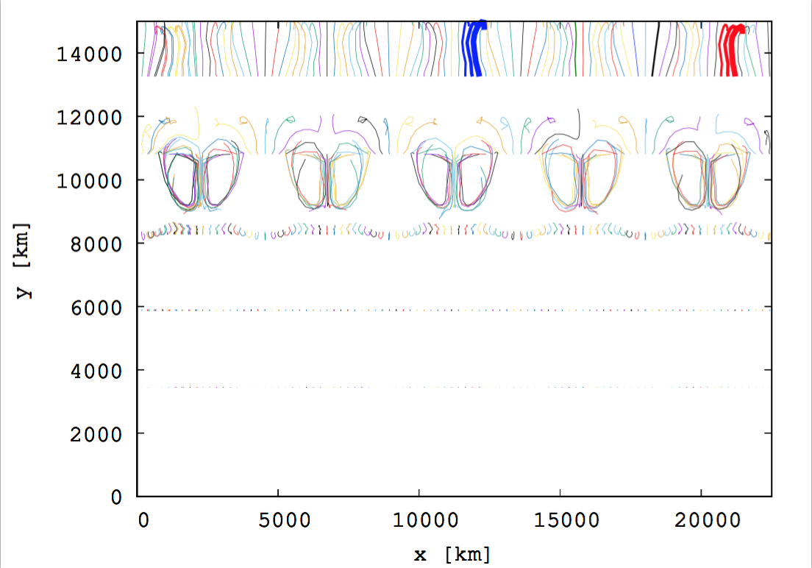

****************
Tracer particles
****************

Tracer particles are to track the Lagrangian evolution of a model
fluid using discrete particles. In hydrodynamical simulations based on
an Eulerian grid (including CASTRO), thermodynamic variables at a
given time are derived by solving the equations of motion of a fluid
between cells. Therefore, in this scheme, the physical quantities that
we can access to are not discretized quantities at any given position,
but rather average values over each cell. However, employing discrete
particles, passively advected with the fluid flow, allows us to obtain
local instantaneous thermodynamic variables, such as the temperature
and the density, at well-defined positions, independent of the spatial
resolution, i.e., the spatial cell size. This means that we can follow
the evolution of the fluid at any given position and time.

CASTRO provides a tracer particle scheme with useful options. In this
scheme, particles are advanced using the midpoint method either with
the cell-centered velocities or the face-centered velocities
(Marker-And-Cell method) [1]_. The number and the initial positions of
particles are flexibly determined according to the purpose of a given
model.

Initializing the Particles
==========================

One must include the tracer particles in the ``GNUmakefile`` by setting::

   USE_PARTICLES = TRUE

And the particles can be initialized via::

   castro.do_tracer_particles = 1

in the ``inputs`` file.

If one wants to investigate the evolution of fluid motions starting from specific positions (or a certain range of area or volume), one should manually specify the positions of particles by providing an input file containing the total number and the initial positions of the particles.
The input file should be in the same directory where your inputs file is located. The name of the input file is determined via::

   particles.particle_init_file = particle_file

Here *particle_file* is the user-specified name of the file. The first
line in this file is assumed to contain the number of particles. Each
line after that contains the positions in a coordinate system adopted
for your model. For 3-D cartesian coordinates, :math:`x ~y ~z` For
example, an input file for a model fluid with 6 particles in 2-D
Cartesian coordinates may look like::

    6
    3.28125e+08 9.9198e+08
    5.46875e+08 9.9198e+08
    7.65625e+08 9.9198e+08
    9.84375e+08 9.9198e+08
    1.20312e+09 9.9198e+08
    1.42188e+09 9.9198e+08

According to this input file, the 6 particles will be positioned at
the same height (same :math:`y` coordinate in the second column),
equally spaced in :math:`x` direction (the first column except for the
particle number on the first line) from :math:`3.28\times10^{8} {\rm
~cm}` to :math:`1.42\times 10^{9} {\rm ~cm}`.

.. _particles:output_file:

Output file
===========

The output files are stored in a directory whose name is determined by
a variable ``particles.timestamp_dir``. For example, if the variable is
set as follows::

  particles.timestamp_dir = particle\_dir

A directory *particle_dir* is automatically made with the directories
for the main CASTRO output file (``pltXXXXX``) once a simulation starts
and the particle output files are stored inside that directory.

The name of the output file consists of ``Timestamp_`` along with a
number at the end. The number increases (typically from 00) as more
processors are involved in following the trajectories of particles. In
parallel computing, a computational domain is divided according to the
number of processors requested. Then each processor only follows the
particles on the domain assigned to that processor and records their
positions and velocities at any given time in a different output
file. Since it is possible for particles to move from one domain to
another during the evolution, its history can be stored in different
files. More output files (with larger numbers at the end of the file
name) can be produced as more processors track the particles.

By default, the output file contains the positions and velocities of
all particles at a given time, meaning [:math:`3+ 2\times`\
dimensionality] columns. For example, for particles in a 3-D domain,
the columns in the output file are,

:math:`{\rm index1}~~{\rm index2}~~x~~ y~~ z~~ t~~ v_{\rm x} ~~v_{\rm y}~~ v_{\rm z}~~ [\rho ~~ T]`

The first two integers correspond to the particle index and the
processor number.  One should use the two numbers in order to identify
a particle and extract its history (i.e., the trajectory in :numref:`fig:particletrajectory`.

.. figure:: fluid_motion.png

   A model atmosphere with the arrows showing the direction of the fluid motion.

.. _fig:particletrajectory:

   The trajectories of 500 particles following the fluid motion on the
   atmosphere. The particles are initially positioned at five
   different heights, :math:`y=13000\mathrm{~km},~11000\mathrm{~km},~
   8000\mathrm{~km},~ 6000\mathrm{~km}, ~38000\mathrm{~km}` (100
   particles at each height).  The solid lines represent the
   trajectories of the particles.

One can also add the last two columns :math:`[\rho ~~ T]`, i.e., the
local density and local temperature of fluid at the position of each
particle by setting the following::

    particles.timestamp_temperature= 1
    particles.timestamp_density = 1

For example, let’s consider 10 particles on a domain. If 4 out 10
particles are initially on a processor and the rest are on another
processor, this means two processors are tracking the particles and
two output files are produced. In the output file written by the
processor with 4 particles, one can find that four lines are stored at
the same time and each line corresponds to each particle info. while
in the other output file for the other 6 particles, 6 lines are stored
at the same time.

Run-time Screen Output
----------------------

The verbosity written to the screen at run-time is turned off by setting::

    particles.v = 0

.. [1]
   One can simplify interpolation with the cell-centered
   velocity. However, this can lead to decoupling of the pressure and
   the velocity components, possibly resulting in instability. This
   can be avoided with the face-centered velocity
