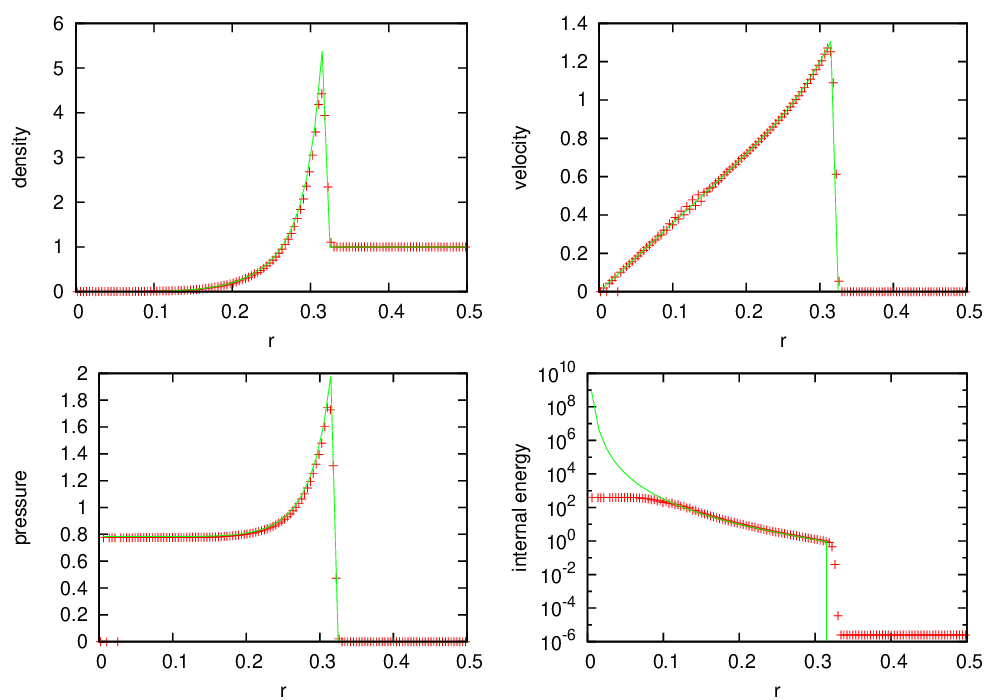

************
Verification
************

Hydrodynamics Test Problems
===========================

Sod’s Problem (and Other Shock Tube Problems)
---------------------------------------------

The Exec/hydro_tests/Sod problem directory sets up a general one-dimensional
shock tube. The left and right primitive-variable states are specified
and the solution evolves until a user-specified end time. For a simple
discontinuity, the exact solution can be found from an exact Riemann
solver. For this problem, the exact solutions were computed with the
exact Riemann solver from Toro :cite:`toro:1997`, Chapter 4.

Sod’s Problem
~~~~~~~~~~~~~

The Sod problem :cite:`sod:1978` is a simple shock tube problem that
exhibits a shock, contact discontinuity, and a rarefaction wave.
The initial conditions are:

.. math::

   \begin{array}{l}
   \rho_L = 1 \\
   u_L = 0 \\
   p_L = 1
   \end{array}
   \qquad
   \begin{array}{l}
   \rho_R = 0.125 \\
   u_R = 0 \\
   p_R = 0.1
   \end{array}

The gamma_law equation of state is used with :math:`\gamma = 1.4`.
The system is evolved until :math:`t = 0.2` s. Setups for 1-, 2-, and 3-d
are provided. The following inputs files setup the
Sod’s problem:

+------------------+-----------------------------------------+
| ``inputs-sod-x`` | Sod’s problem along :math:`x`-direction |
+------------------+-----------------------------------------+
| ``inputs-sod-y`` | Sod’s problem along :math:`y`-direction |
+------------------+-----------------------------------------+
| ``inputs-sod-z`` | Sod’s problem along :math:`z`-direction |
+------------------+-----------------------------------------+

For multi-dimensional runs, the directions transverse to the jump are
kept constant. We use a CFL number of 0.9, an initial timestep shrink
(castro.init_shrink) of 0.1, and the maximum factor by which
the timestep can increase (castro.change_max) of 1.05.

.. _fig:sod:

   Castro solution for Sod’s problem run in 3-d, with the newest ppm
   limiters, along the :math:`x`, :math:`y`, and :math:`z` axes. A
   coarse grid of 32 zones in the direction of propagation, with 2
   levels of refinement was used. The analytic solution appears as the
   red line.

.. _fig:sod_ppm0:

   Castro solution for Sod’s problem run in 3-d, with the
   piecewise-linear Godunov method with limiters, along the :math:`x`,
   :math:`y`, and :math:`z` axes. A coarse grid of 32 zones in the
   direction of propagation, with 2 levels of refinement was used. The
   analytic solution appears as the red line.

:numref:`fig:sod` shows the Castro solution using the newest PPM limiters
compared to the analytic
solution, showing the density, velocity, pressure, and internal energy.
:numref:`fig:sod_ppm0` is the same as :numref:`fig:sod`,
but with the piecewise-linear Godunov method with limiters,
shown for comparison.

The Verification subdirectory includes the analytic solution for
the Sod problem sod-exact.out, with :math:`\gamma = 1.4`. 1-d slices
can be extracted from the Castro plotfile using the fextract tool
from ``amrex/Tools/Postprocessing/C_Src/``.
The steps to generate this verification plot with Castro are:

#. in ``Exec/hydro_tests/Sod``, build the Castro executable in 3-d

#. run the Sod problem with Castro in the :math:`x`, :math:`y`, and :math:`z` directions::

    ./Castro3d.Linux.Intel.Intel.ex inputs-sod-x
    ./Castro3d.Linux.Intel.Intel.ex inputs-sod-y
    ./Castro3d.Linux.Intel.Intel.ex inputs-sod-z

#. build the fextract tool in ``amrex/Tools/Postprocessing/C_Src/`` .

#. run fextract on the Castro output to generate 1-d slices
   through the output::

    fextract3d.Linux.Intel.exe -d 1 -s sodx.out -p sod_x_plt00034
    fextract3d.Linux.Intel.exe -d 2 -s sody.out -p sod_y_plt00034
    fextract3d.Linux.Intel.exe -d 3 -s sodz.out -p sod_z_plt00034

#. copy the sodx/y/z.out files into the ``Verification/`` directory.

#. in ``Verification/`` run the gnuplot script ``sod_3d.gp`` as::

    gnuplot sod_3d.gp

   This will produce the figure ``sod_3d.eps``.

Double Rarefaction
~~~~~~~~~~~~~~~~~~

The double rarefaction is the “Test 2” problem described by Toro
:cite:`toro:1997`, Chapter 6. In this test, the center of the domain
is evacuated as two rarefaction waves propagate in each direction, outward
from the center. It is difficult to get the internal energy to
behave at the center of the domain because we are creating a vacuum.
The initial conditions are:

.. math::

   \begin{array}{l}
   \rho_L = 1 \\
   u_L = -2 \\
   p_L = 0.4
   \end{array}
   \qquad
   \begin{array}{l}
   \rho_R = 1 \\
   u_R = 2 \\
   p_R = 0.4
   \end{array}

The gamma_law equation of state is used with :math:`\gamma = 1.4`.
The system is evolved until :math:`t = 0.15` s. Setups for 1-, 2-, and 3-d
are provided. The following inputs files setup the
double rarefaction problem:

+-----------------------+-----------------------+
| ``inputs-test2-x``    | Double rarefaction    |
|                       | problem along         |
|                       | :math:`x`-direction   |
+-----------------------+-----------------------+
| ``inputs-test2-y``    | Double rarefaction    |
|                       | problem along         |
|                       | :math:`y`-direction   |
+-----------------------+-----------------------+
| ``inputs-test2-z``    | Double rarefaction    |
|                       | problem along         |
|                       | :math:`z`-direction   |
+-----------------------+-----------------------+

We use a CFL number of 0.8, an initial timestep shrink
(``castro.init_shrink``) of 0.1, and the maximum factor by which the
timestep can increase (``castro.change_max``) of 1.05. The PPM solver with
the new limiters are used.

.. _fig:test2:

   Castro solution for the double rarefaction problem run in 3-d,
   along the :math:`x`, :math:`y`, and :math:`z` axes. A coarse grid
   of 32 zones in the direction of propagation, with 2 levels of
   refinement was used. The analytic solution appears as the red line.

:numref:`fig:test2` shows the Castro output, run along all 3
coordinate axes in 3-d, compared to the analytic solution.

The comparison to the analytic solution follows the same procedure as
described for the Sod’s problem above. The gnuplot script
``test2_3d.gp`` will generate the figure, from the 1-d slices created by
fextract named test2x.out, test2y.out, and test2z.out.

Strong Shock
~~~~~~~~~~~~

The strong shock test is the “Test 3” problem described by Toro
:cite:`toro:1997`, Chapter 6. In this test, a large pressure jump
at the initial interface creates a very strong rightward moving
shock, followed very closely by a contact discontinuity.
The initial conditions are:

.. math::

   \begin{array}{l}
   \rho_L = 1 \\
   u_L = 0 \\
   p_L = 1000
   \end{array}
   \qquad
   \begin{array}{l}
   \rho_R = 1 \\
   u_R = 0 \\
   p_R = 0.01
   \end{array}

The gamma_law equation of state is used with :math:`\gamma = 1.4`.
The system is evolved until :math:`t = 0.012` s. Setups for 1-, 2-, and 3-d
are provided. The following inputs files and probin files setup the
strong shock problem:

+-----------------------+-----------------------+
| ``inputs-test3-x``    | Strong shock problem  |
|                       | along                 |
|                       | :math:`x`-direction   |
+-----------------------+-----------------------+
| ``inputs-test3-y``    | Strong shock problem  |
|                       | along                 |
|                       | :math:`y`-direction   |
+-----------------------+-----------------------+
| ``inputs-test3-z``    | Strong shock problem  |
|                       | along                 |
|                       | :math:`z`-direction   |
+-----------------------+-----------------------+

We use a CFL number of 0.9, an initial
timestep shrink (``castro.init_shrink``) of 0.1, and the maximum factor by which
the timestep can increase (``castro.change_max``) of 1.05. The PPM
solver with the new limiters are used.

.. _fig:test3:

   Castro solution for the strong shock problem run in 3-d, along the
   :math:`x`, :math:`y`, and :math:`z` axes. A coarse grid of 32 zones
   in the direction of propagation, with 2 levels of refinement was
   used. The analytic solution appears as the red line.

:numref:`fig:test3` shows the Castro output, run along all 3
coordinate axes in 3-d, compared to the analytic solution.

The comparison to the analytic solution follows the same procedure as
described for the Sod’s problem above. The gnuplot script
``test3_3d.gp`` will generate the figure, from the 1-d slices created by
fextract named test3x.out, test3y.out, and test3z.out.

Sedov Problem
-------------

The Sedov (or Sedov-Taylor) blast wave is a standard hydrodynamics
test problem. A large amount of energy is placed into a very small
volume, driving a spherical or cylindrical blast wave.
Analytic solutions were found by Sedov :cite:`sedov:1959`.

A cylindrical blast wave (e.g. a point explosion in a 2-d plane) can
be modeled in 1-d cylindrical coordinate or 2-d Cartesian coordinates.
A spherical blast wave can be modeled in 1-d spherical, 2-d axisymmetric
(cylindrical :math:`r`-:math:`z`), 2-d axisymmetric
(spherical :math:`r`-:math:`\theta`),or 3-d Cartesian coordinates.
This provides a good test on the geometric factors in the hydrodynamics solver.
We use a publicly available code, ``sedov3.f``
:cite:`timmes_sedov_code`, to generate the analytic solutions.

The Castro implementation of the Sedov problem is ``in
Exec/hydro_tests/Sedov/``.  A number of different inputs files
are provided, corresponding to different Sedov/Castro geometries. The
main ones are:

.. _table:sedov_inputs:
.. table:: Sedov problem inputs files

     +---------------------------------+---------------------------------------------+
     | inputs file                     | description                                 |
     +=================================+=============================================+
     | ``inputs.1d.cyl``               |  Spherical Sedov explosion modeled          |
     |                                 |  in 1-d cylindrical coordinates             |
     +---------------------------------+---------------------------------------------|
     | ``inputs.1d.sph``               |  Spherical Sedov explosion modeled          |
     |                                 |  in 1-d spherical coordinates               |
     +---------------------------------+---------------------------------------------+
     | ``inputs.2d.sph_in_cylcoords``  |  Spherical Sedov explosion modeled          |
     |                                 |  in 2-d cylindrical (axisymmetric)          |
     |                                 |  coordinates.                               |
     +---------------------------------+---------------------------------------------+
     | ``inputs.2d.sph_in_sphcoords``  |  Spherical Sedov explosion modeled          |
     |                                 |  in 2-d spherical (axisymmetric)            |
     |                                 |  coordinates.                               |
     +---------------------------------+---------------------------------------------+
     | ``inputs.2d.cyl_in_cartcoords`` |  Cylindrical Sedov explosion modeled in     |
     |                                 |  2-d Cartesian coordinates.                 |
     +---------------------------------+---------------------------------------------+
     | ``inputs.3d.sph``               |  Spherical Sedov explosion modeled in       |
     |                                 |  3-d Cartesian coordinates.                 |
     +---------------------------------+---------------------------------------------+

In the Sedov problem, the explosion energy, :math:`E_\mathrm{exp}` (in units
of energy, not energy/mass or energy/volume)
is to be deposited into a single point, in a medium of uniform ambient
density, :math:`\rho_\mathrm{ambient}`, and pressure, :math:`p_\mathrm{ambient}`.
Initializing the problem can be difficult because the small volume is
typically only a cell in extent. This can lead to grid imprinting in
the solution. A standard solution (see for example :cite:`omang:2006`
and the references therein)
is to convert the explosion energy into a pressure contained within a
certain volume, :math:`V_\mathrm{init}`, of radius :math:`r_\mathrm{init}` as

.. math:: p_\mathrm{init} = \frac{(\gamma - 1) E_\mathrm{exp}}{V_\mathrm{init}}

This pressure is then deposited in all of the cells where :math:`r <
r_\mathrm{init}`.

To further minimize any grid effects, we do subsampling
in each zone: each zone is divided it into :math:`N_\mathrm{sub}` subzones in each
coordinate direction, each subzone is initialized independently, and
then the subzones are averaged together (using a volume weighting for
spherical or cylindrical/axisymmetric Castro grids) to determine the
initial state of the full zone.

For these runs, we use :math:`\rho_\mathrm{ambient} = 1`,
:math:`p_\mathrm{ambient} = 10^{-5}`, :math:`E_\mathrm{exp} = 1`, :math:`r_\mathrm{init} = 0.01`,
and :math:`N_\mathrm{sub} = 10`. A base grid with 32 zones in each
coordinate direction plus 3 levels of refinement is used (the finest
mesh would correspond to 256 zones in a coordinate direction). The
domain runs from 0 to 1 in each coordinate direction.

An analysis routines for the Sedov problem is provided in
``Castro/Diagnostics/Sedov/``.  Typing ``make`` should build it (you
can specify the dimensionality with the ``DIM`` variable in the
build).

A spherical Sedov explosion can be modeled in 1-d spherical, 2-d
cylindrical (axisymmetric), 2-d spherical (axisymmetric), or
3-d Cartesian coordinates, using the inputs files described in
:numref:`table:sedov_inputs`. A 1-d radial profile can be extracted
using the analysis routine. For example, to run and process
the 2-d spherical Sedov explosion in cylindrical coordinates, one would do:

#. in ``Exec/hydro_tests/Sedov``, build the Castro executable in 2-d::

     make DIM=2

#. run the spherical Sedov problem with Castro in 2-d cylindrical coordinates::

     ./Castro2d.gnu.MPI.ex inputs.2d.sph_in_cylcoords

#. build the ``sedov_2d.ex`` tool in ``Castro/Diagnostics/Sedov``::

     make DIM=2

#. run the analysis script  on the Castro output to generate 1-d radial
   profiles::

     ./sedov_2d.ex -s sedov_2d_sph_in_cyl.out \
          -p ../sedov_2d_sph_in_cyl_plt00130

A similar procedure can be used for the spherical and cylindrical
Sedov explosions in other geometries and dimensions. Once this is done,
the ``sedov_sph.gp`` and ``sedov_cyl.gp`` gnuplot script can be used to
make a plot comparing the numerical solutions to the analytic solution
for spherical and cylindrical Sedov explosions, which are contained
in ``spherical_sedov.dat`` and ``cylindrical_sedov.dat``, respectively.
Note that the file containing the 1-d radial profiles of the numerical
solution has the same name as the one specified in the gnuplot script.

:numref:`fig:sedov_sph` shows the comparison of the 3 Castro spherical
        Sedov explosion simulations to the analytic solution.

.. _fig:sedov_sph:

   Castro solution for the Sedov blast wave problem run in 1-d spherical,
   2-d cylindrical, 2-d spherical, and 3-d Cartesian coordinates.
   Each of these geometries produces a spherical Sedov explosion.

Cylindrical Blast Wave
~~~~~~~~~~~~~~~~~~~~~~

   Castro solution for the Sedov blast wave problem run in 1-d cylindrical and
   2-d Cartesian coordinates. This corresponds to a cylindrical Sedov
   explosion.

Rayleigh-Taylor
---------------

2D. Domain size 0.5 by 1.0. 256 by 512 cells, single level
calculation. Periodic in x, solid walls on top and bottom in y.
Gamma law gas with :math:`\gamma=1.4`, no reactions. Zero initial velocity.
Constant :math:`|\gb|=1`. The density profile is essentially :math:`\rho=1` on
bottom, :math:`\rho=2` on top, but with a perturbation. A single-mode
perturbation is constructed as:

.. math:: \tilde y(x) = 0.5 + 0.01 \frac{\cos(4\pi x) + \cos(4\pi(L_x - x))}{2}

We note that the symmetric form of the cosine is done to ensure that
roundoff error does not introduce a left-right asymmetry in the problem.
Without this construction, the R-T instability will lose its symmetry
as it evolves. This then applied to the interface with a tanh profile
to smooth the transition between the high and low density material:

.. math:: \rho(x,y) = 1 + 0.5\left[1+\tanh\left(\frac{y-\tilde y(x)}{0.005}\right)\right]

Hydrostatic pressure with :math:`p=5.0` at bottom of domain, assuming
:math:`\rho=1` on the lower half of the domain, and :math:`\rho=2` on the upper
half and no density perturbation. We run to :math:`t=2.5` with piecewise
linear, old PPM, and new PPM. CFL=0.9. See :numref:`fig:RT`.

.. _fig:RT:
.. figure:: RT_ppm_type.png
   :alt: Rayleigh-Taylor with different PPM types.
   :align: center
   :width: 6.5in

   Rayleigh-Taylor with different PPM types.

Gravity Test Problems
=====================

Radiation Test Problems
=======================

There are two photon radiation solvers in Castro—a gray solver and a
multigroup solver. The gray solver follows the algorithm outlined
in :cite:`howellgreenough:2003`. We use the notation described in that
paper. In particular, the radiation energy equation takes the form
of:

.. math::

   \frac{\partial E_R}{\partial t} =
    \nabla \cdot \left ( \frac{c \lambda(E_R)}{\kappa_R} \nabla E_R \right ) +
    \kappa_P (4 \sigma T^4 - c E_R )

Here, :math:`E_R` is the radiation energy density, :math:`\kappa_R` is the
Roseland-mean opacity, :math:`\kappa_P` is the Planck-mean opaciy, and
:math:`\lambda` is a quantity :math:`\le 1/3` that is subjected to limiting to
keep the radiation field causal. Castro allows for :math:`\kappa_R`
and :math:`\kappa_P` to be set independently as power-laws.

Light Front
-----------

The light front problem tests the ability of the radiation solver to
operate in the free-streaming limit. A radiation front is
established by initializing one end of the computational domain with
a finite radiation field, and zero radiation field everywhere else.
The speed of propagation of the radiation front is keep in check by
the flux-limiters, to prevent it from exceeding :math:`c`.

Diffusion of a Gaussian Pulse
-----------------------------

The diffusion of a Gaussian pulse problem tests the diffusion term in
the radiation energy equation. The radiation energy density is
initialized at time :math:`t = t_0` to a Gaussian distribution:

.. math:: E_R = (E_R)_0 \exp \left \{ - \frac{1}{4 D t_0} |r - r_0|^2 \right \}

As the radiation diffuses, the overall distribution will remain
Gaussian, with the time-dependent solution of:

.. math:: E_R = (E_R)_0 \frac{t_0}{t_0 + t} \exp \left \{ -\frac{1}{4 D (t_0 + t)} |r - r_0|^2 \right \}

Radiation Source Problem
------------------------

The radiation source problem tests the coupling between the radiation
field and the gas energy through the radiation source term. The
problem begins with the radiation field and gas temperature out of
equilibrium. If the gas is too cool, then the radiation field will
heat it. If the gas is too hot, then it will radiate and cool. In
each case, the gas energy and radiation field will evolve until
thermal equilibrium is achieved.

Our implementation of this problem follows that of
:cite:`swestymyra:2009`.

.. figure:: radiating_source.png
   :alt: radiatin source
   :align: center
   :width: 5in

   Castro solution for radiating source test problem. Heating and
   cooling solutions are shown as a function of time, compared to the
   analytic solution. The gray photon solver was used.

Radiating Sphere
----------------

The radiating sphere (RadSphere) is a multigroup radiation
test problem. A hot sphere is centered at the origin in a spherical
geometry. The spectrum from this sphere follows a Planck
distribution. The ambient medium is at a much lower temperature. A
frequency-dependent opacity makes the domain optically thin for high
frequencies and optically thick for low frequency. At long times, the
solution will be a combination of the blackbody radiation from the
ambient medium plus the radiation that propagated from the hot sphere.
An analytic solution exists :cite:`graziani:2008` which gives the
radiation energy as a function of energy group at a specified time and
distance from the radiating sphere.

Our implementation of this problem is in Exec/radiation_tests/RadSphere and
follows that of :cite:`swestymyra:2009`. The routine that computes
the analytic solution is provided as analytic.f90.

   Castro solution for radiating sphere problem, showing the radiation
   energy density as a function of energy group.  This test was run
   with 64 photon energy groups.

Regression Testing
==================

An automated regression test suite for Castro (or any AMReX-based
code) written in Python exists in the AMReX-Codes github organization.
