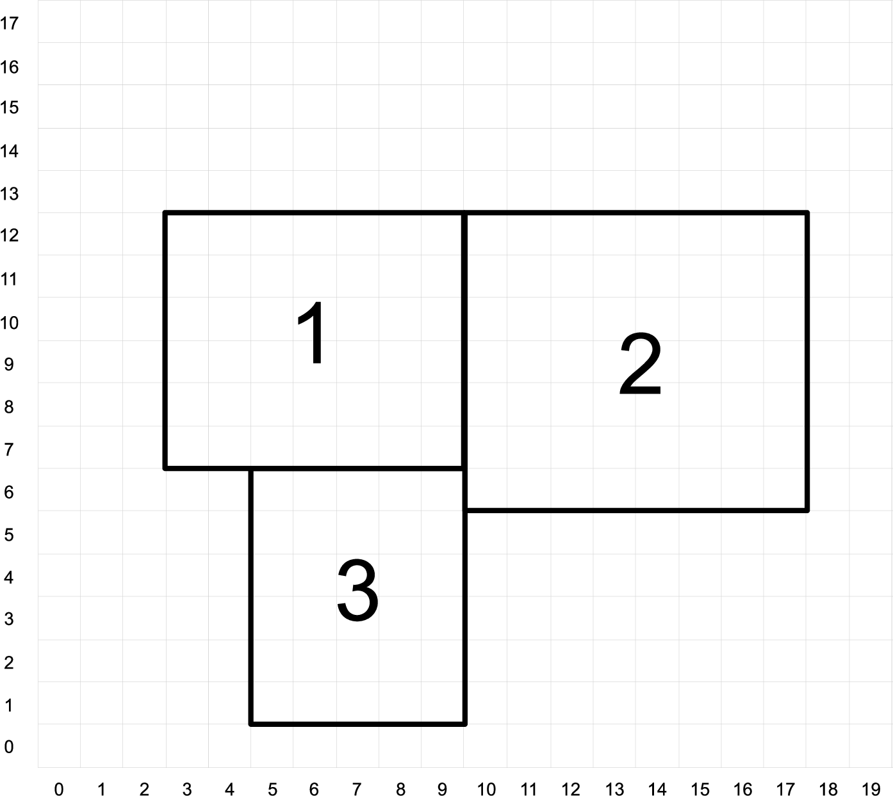
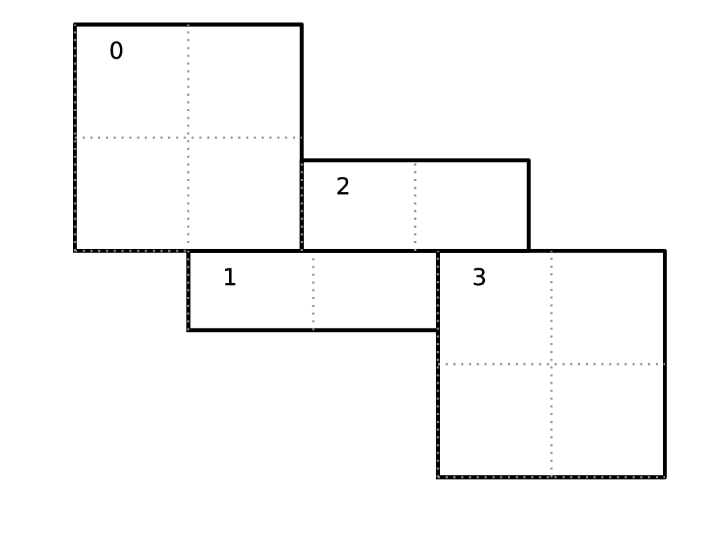

***************
Software Design
***************

Code structure
==============

Castro is built upon the AMReX C framework. This provides
high-level classes for managing an adaptive mesh refinement
simulation, including the core data structures we will deal with. A
key design pattern in AMReX is that the overall memory management
and parallelization is done in the C layer, while the heavy
computational work is done in Fortran kernels. AMReX provides
convenient data structures that allow for this workflow—high level
objects in C that communicate with Fortran through pointers to
data regions that appear as multidimensional arrays.

Castro uses a structured-grid approach to hydrodynamics. We work
with square/cubic zones that hold state variables (density, momentum,
etc.) and compute the fluxes of these quantities through the
interfaces of the zones (this is a finite-volume approach).
Parallelization is achieved by domain decomposition. We divide our
domain into many smaller boxes, and distributed these across
processors. When information is needed at the boundaries of the
boxes, messages are exchanged and this data is held in a perimeter of
*ghost cells*. AMReX manages this decompostion and
communication for us. Additionally, AMReX implements adaptive mesh
refinement. In addition to the coarse decomposition of our domain
into zones and boxes, we can refine rectangular regions by adding
finer-gridded boxes on top of the coarser grid. We call the
collection of boxes at the same resolution a *level*.

Castro uses a hybrid MPI + OpenMP approach to parallelism. MPI is
at used to communicate across nodes on a computer and OpenMP is used
within a node, to loop over subregions of a box with different
threads.

The code structure in the Castro/ directory reflects the
division between C and Fortran.

-  constants/: contains a file of useful constants in CGS units

-  Docs/: you’re reading this now!

-  Exec/: various problem implementations, sorted by category:

   -  gravity_tests/: test problems that primarily exercise the gravity solver

   -  hydro_tests/: test problems of the hydrodynamics (with or without reactions)

   -  radiation_tests/: test problems that primarily exercise the radiation hydrodynamics solver

   -  science/: problem setups that were used for scientific investigations

   -  unit_tests/: test problems that exercise primarily a single module

-  Microphysics/: contains directories for different default
   microphysics (these are all implemented in Fortran)

   -  conductivity/: the thermal conductivity

   -  EOS/: the equation of state

   -  networks/: the nuclear reaction networks

   -  opacity/: the radiative opacity (used with radiation)

   -  viscosity/: the viscous transport coefficient

-  Source/: source code. In this main directory is all of
   the code. Sources are mixed C and Fortran and are organized by topic as:

   -  diffusion/ : thermal diffusion code

   -  driver/ : the main driver, I/O, runtime parameter support

   -  gravity/ : self-gravity code

   -  hydro/ : the compressible hydrodynamics code

   -  particles/ : support for particles

   -  problems/ : template code for implementing a problem

   -  radiation/ : the implicit radiation solve code

   -  reactions/ : nuclear reaction code

   -  rotation/ : rotating code

   -  sources/ : hydrodynamics source terms support

-  Util/: a catch-all for additional things you may need

   -  ConvertCheckpoint/: a tool to convert a checkpoint file to
      a larger domain

   -  :math:`\ldots`

Major data structures
=====================

The following data structures are the most commonly encountered when
working in the C portions of Castro. This are all
AMReX data-structures / classes.

Amr
---

This is the main class that drives the whole simulation. This is
the highest level in Castro.

AmrLevel and Castro classes
---------------------------

An is a virtual base class provided by AMReX that
stores all the state data on a single level in the AMR hierarchy and
understands how to advance that data in time.

The most important data managed by the AmrLevel is an array of
StateData, which holds the fluid quantities, etc., in the boxes
that together make up the level.

The Castro class is derived from the AmrLevel. It provides
the Castro-specific routines to evolve our system of equations. Like
the AmrLevel, there is one Castro object for each level in the
AMR hierarchry.

A lot of the member data in the Castro class are static member
variables—this means that they are shared across all instances of
the class. So, in this case, every level will have the same data.
This is done, in particular, for the values of the runtime parameters,
but also for the Gravity, Diffusion, and Radiation
objects. This means that those objects cover all levels and are the
same object in each instantiation of the Castro class.

Floating point data
-------------------

Floating point data in the C AMReX frame work is declared as
Real. This is typedef to either float or
double depending on the make variable PRECISION.

The corresponding type for Fortran is provided by the
bl_fort_module as c_real. We typically rename
this to rt when using it. An example of a declaration of a
parameter is:

::

      use amrex_fort_module, only : rt => amrex_real                                       

      real(rt) :: tol = 1.0e-10_rt

The bl_constants_module provides common constants that can
be used in the code, like ZERO, THIRD, ONE, etc.

Note: single precision support in Castro is not yet complete. In
particular, a lot of the supporting microphysics has not been updated.

Box and FArrayBox
-----------------

A is simply a rectangular region in space. It does not hold
data. In AMReX, an AMR level has a global index space, with
:math:`(0,0,0)` being the lower left corner of the domain at that level, and
:math:`(N_x-1, N_y-1, N_z-1)` being the upper right corner of the domain
(for a domain of :math:`N_x \times N_y \times N_z` zones). The location of
any Box at a level can be uniquely specified with respect to this
global index space by giving the index of its lower-left and
upper-right corners. Figure \ `[fig:soft:indexspace] <#fig:soft:indexspace>`__ shows an
example of three boxes at the same level of refinement.

AMReX provides other data structures that collect Boxes together,
most importantly the . We generally do not use these
directly, with the exception of the BoxArray grids,
which is defined as part of the AmrLevel class that Castro
inherits. grids is used when building new MultiFabs to give
the layout of the boxes at the current level.

.. raw:: latex

   \centering

   resolution, the domain is 20\ :math:`\times`\ 18 zones. Note that the
   indexing in AMReX starts with :math:`0`.
   :width: 4in

   [fig:soft:indexspace] Three boxes that comprise a single level. At this
   resolution, the domain is 20\ :math:`\times`\ 18 zones. Note that the
   indexing in AMReX starts with :math:`0`.

A or *FAB*, for *Fortran array box* is a data
structure that contains a Box locating it in space, as well as a
pointer to a data buffer. The real floating point data are stored as
one-dimensional arrays in FArrayBoxes. The associated Boxcan be
used to reshape the 1D array into multi-dimensional arrays to be used
by Fortran subroutines. The key part of the C AMReX data
structures is that this data buffer can be sent to Fortran, where it
will appear as a DIM+1 dimensional array (DIM space + 1
component).

Note: Castro is complied for a specific dimensionality.

MultiFab
--------

At the highest abstraction level, we have the (mulitple
FArrayBoxes). A MultiFab contains an array of Boxes, including
Boxes owned by other processors for the purpose of communication,
an array of MPI ranks specifying which MPI processor owns each Box,
and an array of pointers to FArrayBoxes owned by this MPI
processor. Note: a
MultiFab is a collection of the boxes that together make up a single
level of data in the AMR hierarchy.

A MultiFab can have multiple components (like density, temperature,
...) as well as a perimeter of ghost cells to exchange data with
neighbors or implement boundary conditions (this is all reflected in
the underlying FArrayBox).

Parallelization in AMReX is done by distributing the FABs across
processors. Each processor knows which FABs are local to it. To loop
over all the boxes local to a processor, an MFIter is used (more
on this below).

High-level operations exist on MultiFabs to add, subtract, multiply,
etc., them together or with scalars, so you don’t need to write out
loops over the data directly.

In Castro, MultiFabs are one of the main data structures you will
interact with in the C portions of the code.

.. _soft:sec:statedata:

StateData
---------

is a class that essentially holds a pair of MultiFabs: one
at the old time and one at the new time. AMReX knows how to
interpolate in time between these states to get data at any
intermediate point in time. The main data that we care about in
Castro (the fluid state, gravitational potential, etc.) will be
stored as StateData. Essentially, data is made StateData in
Castro if we need it to be stored in checkpoints / plotfiles, and/or
we want it to be automatically interpolated when we refine.

An AmrLevel stores an array of StateData (in a C array
called state). We index this array using integer keys (defined
via an enum in Castro.H). The state data is registered
with AMReX in Castro_setup.cpp.

Note that each of the different StateData carried in the state
array can have different numbers of components, ghost cells, boundary
conditions, etc. This is the main reason we separate all this data
into separate StateData objects collected together in an indexable
array.

The current StateData names Castro carries are:

-  State_Type : this is the NUM_STATE hydrodynamics
   components that make up the conserved hydrodynamics state (usually
   referred to as :math:`\Ub` in these notes. But note that this does
   not include the radiation energy density.

   In Fortran, the components of a FAB derived from State_Type
   is indexed using the integer keys defined in Castro_nd.F90
   and stored in meth_params_module, e.g., URHO, UMX,
   UMY, ...

   Note: regardless of dimensionality, we always carry around all
   three velocity components. The “out-of-plane” components
   will simply be advected, but we will allow rotation (in particular,
   the Coriolis force) to affect them.

   State_Type MultiFabs have no ghost cells by default for
   pure hydro and a single ghost cell by default when RADIATION
   is enabled. There is an option to force them to have ghost cells by
   setting the parameter castro.state_nghost at runtime.

   Note that the prediction of the hydrodynamic state to the interface
   will require 4 ghost cells. This accomodated by creating a separate
   MultiFab, Sborder that lives at the old-time level and
   has the necessary ghost cells. We will describe this more later.

-  Rad_Type : this stores the radiation energy density,
   commonly denoted :math:`E_r` in these notes. It has nGroups
   components—the number of energy groups used in the multigroup
   radiation hydrodynamics approximation.

-  PhiGrav_Type : this is simply the gravitational
   potential, usually denoted :math:`\Phi` in these notes.

-  Gravity_Type : this is the gravitational
   acceleration. There are always 3 components, regardless of the
   dimensionality (consistent with our choice of always carrying all 3
   velocity components).

-  PhiRot_Type : this is the rotational potential.
   When rotation is enabled, this will store the effective potential
   corresponding to the centrifugal force.

-  Rotation_Type : this is the rotational acceleration.
   There are always 3 components, regardless of the dimensionality
   (consistent with our choice of always carrying all 3 velocity
   components). This includes the terms corresponding to the Coriolis
   force, the centrifugal force, as well as optional terms due to the
   change in rotation rate, :math:`\Omega`.

-  Source_Type : this holds the time-rate of change of
   the source terms, :math:`d\Sb/dt`, for each of the NUM_STATE
   State_Type variables.

   .. raw:: latex

      \MarginPar{SDC does differently}

   Note: we do not make use of the old-time quantity here. In fact, we
   never allocate the FArrayBoxs for the old-time in the Source_Type
   StateData, so there is not wasted memory.

-  Reactions_Type : this holds the data for the nuclear
   reactions. It has NumSpec+2 components: the species
   creation rates (usually denoted :math:`\omegadot_k` in these notes),
   the specific energy generation rate (:math:`\dot{e}_\mathrm{nuc}`),
   and its density (:math:`\rho \dot{e}_\mathrm{nuc}`).

   These are stored as StateData so we have access to the reaction terms
   outside of advance, both for diagnostics (like flame speed estimation)
   and for reaction timestep limiting (this in particular needs the
   data stored in checkpoints for continuity of timestepping upon restart).

   .. raw:: latex

      \MarginPar{why do we need rho edot and edot separately?}

-  SDC_React_Type : this is used with the SDC
   time-advancement algorithm. This stores the QVAR terms
   that describe how the primitive variables change over the timestep
   due only to reactions. These are used when predicting the interface
   states of the primitive variables for the hydrodynamics portion of the
   algorithm.

We access the multifabs that carry the data of interest by interacting
with the StateData using one of these keys. For instance:

::

    MultiFab& S_new = get_new_data(State_Type);

gets a pointer to the multifab containing the hydrodynamics state data
at the new time.

Various source MultiFabs
------------------------

There are a number of different MultiFabs (and arrays of MultiFabs)
that hold source term information.

-  hydro_source : this is a MultiFab that holds the
   update to the hydrodynamics (basically the divergence of the
   fluxes). This is filled in the conservative update routine of the
   hydrodynamics.

   As this is expressed as a source term, what is actually stored is

   .. math:: \Sb_\mathrm{flux} = -\nabla \cdot {\bf F}

   So the update of the conserved state appears as:

   .. math:: \frac{\partial \Ub}{\partial t} = \Sb_\mathrm{flux}

-  sources_for_hydro : a single MultiFab that stores
   the sum of sources over each physical process.

MFIter and interacting with Fortran
===================================

The process of looping over boxes at a given level of refinement and
operating on their data in Fortran is linked to how Castro achieves
thread-level parallelism. The OpenMP approach in Castro has evolved
considerably since the original paper was written, with the modern
approach, called *tiling*, gearing up to meet the demands of
many-core processors in the next-generation of supercomputers. We
discuss the original and new approach together here.

In both cases, the key construct is the —this is a
C iterator that knows how to loop over the FArrayBoxes in the
MultiFab that are local to the processor (in this way, a lot of the
parallelism is hidden from view).

Non-Tiling MFIter
-----------------

The non-tiling way to iterate over the FArrayBoxs is
 [1]_:

.. code:: c++

      for (MFIter mfi(mf); mfi.isValid(); ++mfi) // Loop over boxes
      {
        // Get the index space of this iteration
        const Box& box = mfi.validbox();

        // Get a reference to the FAB, which contains data and box
        FArrayBox& fab = mf[mfi];

        // Get the index space for the data region in th FAB.
        // Note "abox" may have ghost cells, and is thus larger than
        // or equal to "box" obtained using mfi.validbox().
        const Box& abox = fab.box();

        // We can now pass the information to a Fortran routine,
        // fab.dataPtr() gives a double*, which is reshaped into
        // a multi-dimensional array with dimensions specified by
        // the information in "abox". We will also pass "box",
        // which specifies our "work" region.
        do_work(ARLIM_3D(box.loVect()), ARLIM_3D(box.hiVect()),
                fab.dataPtr(), fab.nComp(),
                ARLIM_3D(abox.loVect()), ARLIM_3D(abox.hiVect())

      }

A few comments about this code

-  In this example, we are working off of a MultiFab named mf.
   This could, for example, come from state data as:

   ::

        MultiFab& mf = get_old_data(State_Type);

-  We are passing the data in mf one box at a time to the
   Fortran function do_work.

-  Here the MFIter iterator, mfi, will perform the loop
   only over the boxes that are local to the MPI task. If there are 3
   boxes on the processor, then this loop has 3 iterations.

   ++mfi iterates to the next FArrayBox owned by the
   MultiFab mf, and mfi.isValid() returns false
   after we’ve reached the last box contained in the MultiFab,
   terminating the loop.

-  box as returned from mfi.validbox() does not include
   ghost cells. This is the valid data region only.
   We can get the indices of the valid zones as box.loVect() and
   box.hiVect().

   In passing to the Fortran function, we use the macro
   ARLIM_3D, defined in ArrayLim.H to pass the lo
   and hi vectors as pointers to an int array. This array
   is defined to always be 3D, with 0s substituted for the
   higher dimension values if we are running in 1- or 2D.

   Passing the data in this 3D fashion is a newer approach in Castro.
   This enables writing *dimension agnostic code*. There are many
   other approaches that will pass only the DIM values of
   lo and hi using alternate macros in ArrayLim.H.

-  fab.dataPtr() returns a double \*—a pointer to the
   data region. This is what is passed to Fortran.

-  fab.nComp() gives an int—the number of components
   in the MultiFab. This will be used for dimensioning in Fortran.

-  To properly dimension the array in Fortran, we need the actual
   bounds of the data region, including any ghost cells. This is the
   Box abox, obtained as fab.box(). We pass the
   lo and hi of the full data region as well.

To properly compile, we need a prototype for the Fortran
function. These are placed in the \_F.H files in the
Castro Source/ directory. Here’s the prototype for
our function:

.. code:: c++

      void do_work
        (const int* lo, const int* hi,
         Real* state, const Real& ncomp
         const int* s_lo, const int* s_hi)

A few comments on the prototype:

-  we use the const qualifier on the many of the arguments.
   This indicates that the data that is pointed to cannot be
   modified [2]_
   means that the pointers themselves are to be unmodified. But the
   contents of the memory space that they point to can be modified.

-  For ncomp, we in the calling sequence, we just did
   fab.nComp(). This returns a int. But Fortran is a
   pass-by-reference language, so we make the argument in the prototype
   a reference. This ensures that it is passed by reference.

In our Fortran example, we want to loop over all of the data,
including 1 ghost cell all around. The corresponding Fortran function
will look like:

.. code:: fortran

      subroutine do_work(lo, hi, &
                         state, ncomp, &
                         s_lo, s_hi) bind(C, name="do_work")

        use prob_params_module, only : dg

        integer, intent(in) :: lo(3), hi(3)
        integer, intent(in) :: s_lo(3), s_hi(3), ncomp

        real (kind=dp_t), intent(inout) :: state(s_lo(1):s_hi(1), &
                                                 s_lo(2):s_hi(2), &
                                                 s_lo(3):s_hi(3), ncomp)

        ! loop over the data
        do k = lo(3)-1*dg(3), hi(3)+1*dg(3)
           do j = lo(2)-1*dg(2), hi(2)+1*dg(2)
              do i = lo(1)-1*dg(1), hi(1)+1*dg(1)

                 ! work on state(i,j,k,:), where the last index
                 ! is the component of the multifab

              enddo
           enddo
        enddo

      end subroutine do_work

Finally, comments on the Fortran routine;

-  We use the Fortran 2003 bind keyword to specify
   that we want this to be interoperable with C. Ordinarily
   we would not need to specify the optional argument name
   in the binding, but the PGI compiler requires this if our
   Fortran subroutine is part of a module.

-  We dimension state using s_lo and s_hi—these are
   the bounds we got from the FArrayBox, and are for the entire data
   region, including ghost cells.

   Note, in Fortran, the spatial indices of state don’t
   necessarily start at 1—they reflect the global index space
   for the entire domain at this level of refinement. This means that
   we know where the box is located.

   Later we’ll see how to compute the spatial coordinates using this
   information.

-  Our loop uses lo and hi—these are the indices
   of the valid data region (no ghost cells). Since we want a single
   ghost cell all around, we subtract 1 from lo and add 1
   to hi.

   Finally, since this is dimension-agnostic code (it should work
   correctly in 1-, 2-, and 3D), we need to ensure the loops over the
   higher dimensions do nothing when we compile for a lower
   dimensionality. This is the role of dg—dg is 1
   if our simulation includes that spatial dimension and 0
   otherwise.

   If we were not looping over ghost cells too, then we would not need
   to invoke dg, since lo and hi are both set to
   0 for any dimensions not represented in our simulation.

Up to this point, we have not said anything about threading. In this
style of using the MFIter, we implement the OpenMP in Fortran, for
instance by putting a pragma around the outer loop in this example.

.. _sec:boxlib1:

AMReX’s Current Tiling Approach In C++
--------------------------------------

There are two types of tiling that people discuss. In *logical
tiling*, the data storage in memory is unchanged from how we do things
now in pure MPI. In a given box, the data region is stored
contiguously). But when we loop in OpenMP over a box, the tiling
changes how we loop over the data. The alternative is called
*separate tiling*—here the data storage in memory itself is changed
to reflect how the tiling will be performed. This is not considered
in AMReX.

We have recently introduced logical tiling into parts of AMReXİt
is off by default, to make the transition smooth and because not
everything should be tiled. It can be enabled on a loop-by-loop basis
by setting an optional argument to MFIter. We demonstrate this
below. Further examples can be found at Tutorials/Tiling_C,
and Src/LinearSolvers/C_CellMG/.

In our logical tiling approach, a box is logically split into tiles,
and a MFIter loops over each tile in each box. Note that the
non-tiling iteration approach can be considered as a special case of
tiling with the tile size equal to the box size.

Let us consider an example. Suppose there are four boxes—see
Figure \ `[fig:domain-tiling] <#fig:domain-tiling>`__.

.. raw:: latex

   \centering

   Boxes labeled 0–3, and their tiling regions (dotted lines)

   [fig:domain-tiling] A simple domain showing 4
   Boxes labeled 0–3, and their tiling regions (dotted lines)

The first box is divided into 4 logical tiles, the second and third
are divided into 2 tiles each (because they are small), and the fourth
into 4 tiles. So there are 12 tiles in total. The difference between
the tiling and non-tiling version are then:

-  In the tiling version, the loop body will be run 12 times. Note
   that tilebox is different for each tile, whereas fab
   might be referencing the same object if the tiles belong to the same
   box.

-  In the non-tiling version (by constructing MFIter without
   the optional second argument or setting to false), the loop
   body will be run 4 times because there are four boxes, and a call to
   mfi.tilebox() will return the traditional validbox. The
   non-tiling case is essentially having one tile per box.

The tiling implementation of the same call to our the Fortran
do_work routine is show below:

.. code:: c++

      bool tiling = true;
      for (MFIter mfi(mf, tiling); mfi.isValid(); ++mfi) // Loop over tiles
      {
        // Get the index space of this iteration.
        const Box& box = mfi.growntilebox(1);

        // Get a reference to the FAB, which contains data and box
        FArrayBox& fab = mf[mfi];

        // Get the index space for the data pointed by the double*.
        const Box& abox = fab.box();

        // We can now pass the information to a Fortran routine.
        do_work(ARLIM_3D(box.loVect()), ARLIM_3D(box.hiVect()),
                fab.dataPtr(), fab.nComp(),
                ARLIM_3D(abox.loVect()), ARLIM_3D(abox.hiVect())

      }

Note that the code is almost identical to the one in § \ `[sec:boxlib0] <#sec:boxlib0>`__.
Some comments:

-  The iterator now takes an extra argument to turn on tiling (set
   to true).

   There is another interface fo MFIter that can take an
   IntVect that explicitly gives the tile size in each coordinate
   direction. If we don’t explictly specify the tile size at the loop,
   then the runtime parameter fabarray.mfiter_tile_size
   can be used to set it globally.

-  .validBox() has the same meaning as in the non-tile
   approach, so we don’t use it.
   Since in this example, we want to include a single ghost cell in our
   loop over the data, we use .growntilebox(1) (where the 1
   here indicates a single ghost cells) to get the Box (and
   corresponding lo and hi) for the *current tile*, not
   the entire data region. If instead, we just wanted the valid
   region in Fortran, without any ghost cells, we would use
   .tilebox().

-  When passing into the Fortran routine, we still use the index
   space of the entire FArrayBox (including ghost cells), as seen in
   the abox construction. This is needed to properly dimension
   the array in Fortran.

   The Fortran routine will declare a multidimensional array that is of
   the same size as the entire box, but only work on the index space
   identified by the tile-box (box).

The Fortran code is almost the same as before, but now our loop
simply uses lo and hi, since, by construction with
.growntilebox(1), this already includes the single ghost cell
all around:

.. code:: fortran

      subroutine do_work(lo, hi, &
                         state, ncomp, &
                         s_lo, s_hi) bind(C, name="do_work")

        integer, intent(in) :: lo(3), hi(3)
        integer, intent(in) :: s_lo(3), s_hi(3), ncomp

        real (kind=dp_t), intent(inout) :: state(s_lo(1):s_hi(1), &
                                                 s_lo(2):s_hi(2), &
                                                 s_lo(3):s_hi(3), ncomp)

        ! loop over the data
        do k = lo(3), hi(3)
           do j = lo(2), hi(2)
              do i = lo(1), hi(1)

                 ! work on state(i,j,k,:), where the last index
                 ! is the component of the multifab

              enddo
           enddo
        enddo

      end subroutine do_work

The function prototype is unchanged.

Tiling provides us the opportunity of a coarse-grained approach for
OpenMP. Threading can be turned on by inserting the following line
above the for (MFIter...) line.

::

      #pragma omp parallel

Note that the OpenMP pragma does not have a for—this is not
used when working with an iterator.

Assuming four threads are used in the above example, thread 0 will
work on 3 tiles from the first box, thread 1 on 1 tile from the first
box and 2 tiles from the second box, and so forth. Note that
OpenMP can be used even when tiling is turned off. In that case, the
OpenMP granularity is at the box level (and good performance would need
many boxes per MPI task).

The tile size for the three spatial dimensions can be set by a
parameter, e.g., fabarray.mfiter_tile_size = 1024000 8 8. A
huge number like 1024000 will turn off tiling in that direction.
As noted above, the MFIter constructor can also take an explicit
tile size: MFIter(mfi(mf,IntVect(128,16,32))).

Note that tiling can naturally transition from all threads working
on a single box to each thread working on a separate box as the boxes
coarsen (e.g., in multigrid).

The MFIter class provides some other useful functions:

-  mfi.validbox() : The same meaning as before independent of tiling.

-  mfi.tilebox() : The standard way of getting the bounds of the
   current tile box. This will tile over the valid data region only.

-  mfi.growntilebox(int) : A grown tile box that includes
   ghost cells at box boundaries only. Thus the returned boxes for a
   FArrayBox are non-overlapping.

-  mfi.nodaltilebox(int) : Returns non-overlapping
   edge-type boxes for tiles. The argument is for direction.

-  mfi.fabbox() : Same as mf[mfi].box().

Finally we note that tiling is not always desired or better. The
traditional fine-grained approach coupled with dynamic scheduling is
more appropriate for work with unbalanced loads, such as chemistry
burning in cells by an implicit solver. Tiling can also create extra
work in the ghost cells of tiles.

Practical Details in Working with Tiling
~~~~~~~~~~~~~~~~~~~~~~~~~~~~~~~~~~~~~~~~

With tiling, the OpenMP is now all in C, and not in Fortran for all
modules except reactions and initdata.

It is the responsibility of the coder to make sure that the routines
within a tiled region are safe to use with OpenMP. In particular,
note that:

-  tile boxes are non-overlapping

-  the union of tile boxes completely cover the valid region of the
   fab

-  Consider working with a node-centered MultiFab, ugdnv, and
   a cell-centered MultiFab, s:

   -  with mfi(s), the tiles are based on the cell-centered
      index space. If you have an :math:`8\times 8` box, then and 4 tiles,
      then your tiling boxes will range from :math:`0\rightarrow 3`,
      :math:`4\rightarrow 7`.

   -  with mfiugdnv, the tiles are based on nodal indices,
      so your tiling boxes will range from :math:`0\rightarrow 3`,
      :math:`4\rightarrow 8`.

-  When updating routines to work with tiling, we need to
   understand the distinction between the index-space of the entire box
   (which corresponds to the memory layout) and the index-space of the
   tile.

   -  In the C end, we pass (sometimes via the
      BL_TO_FORTRAN() macro) the loVect and hiVect of the
      entire box (including ghost cells). These are then used to
      allocate the array in Fortran as:

      ::

            double precision :: a(a_l1:a_h1, a_l2:a_h2, ...)

      When tiling is used, we do not want to loop as do a_l1,
      a_h1, but instead we need to loop over the tiling region. The
      indices of the tiling region need to be passed into the Fortran
      routine separately, and they come from the mfi.tilebox()
      or mfi.growntilebox() statement.

   -  In Fortran, when initializing an array to 0, do so only
      over the tile region, not for the entire box. For a Fortran array
      a, this means we cannot do:

      ::

            a = 0.0
            a(:,:,:,:) = 0.0

      but instead must do:

      ::

            a(lo(1):hi(1),lo(2):hi(2),lo(3):hi(3),:) = 0.0

      where lo() and hi() are the index-space for the tile box
      returned from mfi.tilebox() in C and passed into the Fortran
      routine.

   -  Look at r_old_s in Exec/gravity_tests/DustCollapse/probdata.f90 as an
      example of how to declare a threadprivate variable—this is then used
      in sponge_nd.f90.

Boundaries: FillPatch and FillPatchIterator
===========================================

AMReX calls the act of filling ghost cells a *fillpatch*
operation. Boundaries between grids are of two types. The first we
call “fine-fine”, which is two grids at the same level. The second
type is "coarse-fine", which needs interpolation from the coarse grid
to fill the fine grid ghost cells. Both of these are part of the
fillpatch operation. Fine-fine fills are just a straight copy from
“valid regions” to ghost cells. Coarse-fine fills are enabled
because the StateData is not just arrays, they’re “State Data”,
which means that the data knows how to interpolate itself (in an
anthropomorphical sense). The type of interpolation to use is defined
in Castro_setup.cpp—search for
cell_cons_interp, for example—that’s “cell conservative
interpolation”, i.e., the data is cell-based (as opposed to
node-based or edge-based) and the interpolation is such that the
average of the fine values created is equal to the coarse value from
which they came. (This wouldn’t be the case with straight linear
interpolation, for example.)

Additionally, since StateData has an old and new timelevel,
the fill patch operation can interpolate to an intermediate time.

Examples
--------

To illustrate the various ways we fill ghost cells and use the data,
let’s consider the following scenarios:

-  *You have state data that was defined with no ghost cells. You
   want to create a new MultiFab containing a copy of that data with
   NGROW ghost cells.*

   This is the case with Sborder—the MultiFab of the
   hydrodynamic state that we use to kick-off the hydrodynamics
   advance.

   Sborder is declared in Castro.H simply as:

   .. code:: c++

         Multifab Sborder;

   It is then allocated in Castro::initialize_do_advance()

   .. code:: c++

         Sborder.define(grids, NUM_STATE, NUM_GROW, Fab_allocate);                   
         const Real prev_time = state[State_Type].prevTime();                        
         expand_state(Sborder, prev_time, NUM_GROW);      

   Note in the call to .define(), we tell AMReX to already
   allocate the data regions for the FArrayBoxs that are part of
   Sborder.

   The actually filling of the ghost cells is done by
   Castro::expand_state():

   .. code:: c++

         AmrLevel::FillPatch(*this, Sborder, NUM_GROW, 
                             prev_time, State_Type, 0, NUM_STATE);                

   Here, we are filling the ng ghost cells of MultiFab
   Sborder at time prev_time. We are using the
   StateData that is part of the current Castro object that we
   are part of. Note: FillPatch takes an object reference as its
   first argument, which is the object that contains the relevant
   StateData—that is what the this pointer indicates.
   Finally, we are copying the State_Type data components 0 to
   NUM_STATE [3]_.

   The result of this operation is that Sborder will now have
   NUM_GROW ghost cells consistent with the State_Type
   data at the old time-level.

-  *You have state data that was defined with NGROW ghost
   cells. You want to ensure that the ghost cells are filled
   (including any physical boundaries) with valid data.*

   This is very similar to the procedure shown above. The main
   difference is that for the MultiFab that will be the target
   of the ghost cell filling, we pass in a reference to the StateData itself.

   The main thing you need to be careful of here, is that you
   need to ensure that the the time you are at is consistent with
   the StateData’s time. Here’s an example from the radiation
   portion of the code MGFLDRadSolver.cpp:

   .. code:: c++

         Real time = castro->get_state_data(Rad_Type).curTime();
         MultiFab& S_new = castro->get_new_data(State_Type);

         AmrLevel::FillPatch(*castro, S_new, ngrow, time, State_Type,
                             0, S_new.nComp(), 0); 

   In this example, S_new is a pointer to the new-time-level
   State_Type MultiFab. So this operation will use the
   State_Type data to fill its own ghost cells. we fill the
   ngrow ghost cells of the new-time-level State_Type data,
   for all the components.

   Note that in this example, because the StateData lives in the
   Castro object and we are working from the Radiation object,
   we need to make reference to the current castro object
   pointer. If this were all done within the Castro object, then
   the pointer will simply be this, as we saw above.

-  *You have a MultiFab with some derived quantity. You want to
   fill its ghost cells.*

   MultiFabs have a FillBoundary() method that will fill all
   the ghost cells between boxes at the same level. It will not fill
   ghost cells at coarse-fine boundaries or at physical boundaries.

-  *You want to loop over the FABs in state data, filling ghost cells
   along the way*

   This is the job of the —this iterator is used to
   loop over the grids and fill ghostcells. A key thing to keep in
   mind about the FillPatchIterator is that you operate on a copy
   of the data—the data is disconnected from the original source. If
   you want to update the data in the source, you need to explicitly
   copy it back. Also note: FillPatchIterator takes a multifab,
   but this is not filled—this is only used to get the grid
   layout. Finally, the way the FillPatchIterator is implemented
   is that all the communication is done first, and then the iterating
   over boxes commences.

   For example, the loop that calls CA_UMDRV (all the
   hydrodynamics integration stuff) starts with

   ::

          for (FillPatchIterator fpi(*this, S_new, NUM_GROW,
                                     time, State_Type, strtComp, NUM_STATE);
                fpi.isValid(); ++fpi)
          {
            FArrayBox &state = fpi();
            Box bx(fpi.validbox());

            // work on the state FAB.  The interior (valid) cells will 
            // live between bx.loVect() and bx.hiVect()
          }

   Here the FillPatchIterator is the thing that distributes the
   grids over processors and makes parallel “just work”. This fills the
   single patch “fpi” , which has NUM_GROW ghost cells,
   with data of type “State_Type” at time “time”,
   starting with component strtComp and including a total of
   NUM_STATE components.

In general, one should never assume that ghostcells are valid, and
instead do a fill patch operation when in doubt. Sometimes we will
use a FillPatchIterator to fill the ghost cells into a multifab
without an explict look. This is done as:

::

      FillPatchIterator fpi(*this,S_old,1,time,State_Type,0,NUM_STATE);
      MultiFab& state_old = fpi.get_mf();     

In this operation, state_old points to the internal
MultiFab in the FillPatchIterator, by getting a reference to it as
fpi.get_mf(). This avoids a local copy.

Note that in the examples above, we see that only StateData can fill
physical boundaries (because these register how to fill the boundaries
when they are defined). There are some advanced operations in
AMReX that can get around this, but we do not use them in Castro.

.. _soft:phys_bcs:

Physical Boundaries
-------------------

Physical boundary conditions are specified by an integer
index [4]_ in
the inputs file, using the castro.lo_bc and
castro.hi_bc runtime parameters. The generally
supported boundary conditions are, their corresponding integer key,
and the action they take for the normal velocity, transverse
velocity, and generic scalar are shown in Table \ `[table:castro:bcs] <#table:castro:bcs>`__

The definition of the specific actions are:

-  INT_DIR: data taken from other grids or interpolated

-  EXT_DIR: data specified on EDGE (FACE) of bndry

-  HOEXTRAP: higher order extrapolation to EDGE of bndry

-  FOEXTRAP: first order extrapolation from last cell in interior

-  REFLECT_EVEN: :math:`F(-n) = F(n)` true reflection from interior cells

-  REFLECT_ODD: :math:`F(-n) = -F(n)` true reflection from interior cells

The actual registration of a boundary condition action to a particular
variable is done in Castro_setup.cpp. At the top we define
arrays such as “scalar_bc”, “norm_vel_bc”, etc,
which say which kind of bc to use on which kind of physical boundary.
Boundary conditions are set in functions like “
set_scalar_bc”, which uses the scalar_bc pre-defined
arrays. We also specify the name of the Fortran routine that
is responsible for filling the data there (e.g., hypfill).
These routines are discussed more below.

If you want to specify a value at a function (like at an inflow
boundary), then you choose an *inflow* boundary at that face of
the domain. You then need to write the implementation code for this.
An example is the problem toy_convect which implements a
hydrostatic lower boundary (through its custom bc_fill_?d.F90
routines.

.. raw:: latex

   \centering

.. table:: [table:castro:bcs] Physical boundary conditions supported in Castro. why does slipwall and noslipwall do the same thing?

   +-------------+-------------+-------------+-------------+-------------+
   | **name**    | **integer** | **normal    | **transvers | **scalars** |
   |             |             | velocity**  | e           |             |
   |             |             |             | velocity**  |             |
   +=============+=============+=============+=============+=============+
   | interior    | 0           | INT_DIR     | INT_DIR     | INT_DIR     |
   +-------------+-------------+-------------+-------------+-------------+
   | inflow      | 1           | EXT_DIR     | EXT_DIR     | EXT_DIR     |
   +-------------+-------------+-------------+-------------+-------------+
   | outflow     | 2           | FOEXTRAP    | FOEXTRAP    | FOEXTRAP    |
   +-------------+-------------+-------------+-------------+-------------+
   | symmetry    | 3           | REFLECT_ODD | REFLECT_EVE | REFLECT_EVE |
   |             |             |             | N           | N           |
   +-------------+-------------+-------------+-------------+-------------+
   | slipwall    | 4           | REFLECT_ODD | REFLECT_EVE | REFLECT_EVE |
   |             |             |             | N           | N           |
   +-------------+-------------+-------------+-------------+-------------+
   | noslipwall  | 5           | REFLECT_ODD | REFLECT_EVE | REFLECT_EVE |
   |             |             |             | N           | N           |
   +-------------+-------------+-------------+-------------+-------------+

FluxRegister
------------

A FluxRegister holds face-centered data at the boundaries of a box.
It is composed of a set of MultiFabs (one for each face, so 6 for
3D). A FluxRegister stores fluxes at coarse-fine interfaces,
and isused for the flux-correction step.

Other AMReX Concepts
====================

There are a large number of classes that help define the structure of
the grids, metadata associate with the variables, etc. A good way to
get a sense of these is to look at the .H files in the
amrex/Src/ directory.

Geometry class
--------------

There is a Geometry object, geom for each level as part of
the Castro object (this is inhereted through AmrLevel).

ParmParse class
---------------

Error Estimators
----------------

Gravity class
=============

There is a single Gravity object, gravity, that is a
static class member of the Castro object. This means that all
levels refer to the same Gravity object.

Within the Gravity object, there are pointers to the Amr
object (as parent), and all of the AmrLevels (as a PArray,
LevelData). The gravity object gets the geometry
information at each level through the parent Amr class.

The main job of the gravity object is to provide the potential
and gravitation acceleration for use in the hydrodynamic sources.
Depending on the approximation used for gravity, this could mean
calling the AMReX multigrid solvers to solve the Poisson equation.

Fortran Helper Modules
======================

There are a number of modules that make data available to the Fortran
side of Castro or perform other useful tasks.

-  bl_constants_module:

   This provides double precision constants as Fortran parameters, like
   ZERO, HALF, and ONE.

-  bl_types:

   This provides a double precision type, dp_t for use in
   Fortran. This should be identical to double precision on most
   architectures.

-  extern_probin_module:

   This module provides access to the runtime parameters for the
   microphysics routines (EOS, reaction network, etc.). The source
   for this module is generated at compile type via a make rule
   that invokes a python script. This will search for all of the
   \_parameters files in the external sources, parse them
   for runtime parameters, and build the module.

-  fundamental_constants_module:

   This provides the CGS values of many physical constants.

-  math_module:

   This provides simple mathematical functions. At the moment, a cross
   product routine.

-  meth_params_module:

   This module provides the integer keys used to access the state
   arrays for both the conserved variables (URHO, UMX, :math:`\ldots`)
   and primitive variables (QRHO, QU, :math:`\ldots`), as well
   as the number of scalar variables.

   It also provides the values of most of the castro.\ *xxxx*
   runtime parameters.

-  model_parser_module:

   This module is built if USE_MODELPARSER = TRUE is set in the
   problem’s GNUmakefile. It then provides storage for the an
   initial model and routines to read it in and interpolate onto the
   Castro grid.

-  prob_params_module:

   [soft:prob_params]

   This module stores information about the domain and current level,
   and is periodically synced up with the C driver. The information
   available here is:

   -  physbc_lo, physbc_hi: these are the boundary
      condition types at the low and high ends of the domain, for each
      coordinate direction. Integer keys, Interior, Inflow,
      Outflow, Symmetry, SlipWall, and
      NoSlipWall allow you to interpret the values.

   -  center is the center of the problem. Note—this is up
      to the problem setup to define (in the probinit subroutine).
      Alternately, it can be set at runtime via
      castro.center.

      Usually center will be the physical center of the domain,
      but not always. For instance, for axisymmetric problems,
      center may be on the symmetry axis.

      center is used in the multipole gravity, hybrid advection
      algorithm, rotation sources, for the point mass gravity, in
      defining the center of the sponge, and in deriving the radial
      velocity.

   -  coord_type

   -  dim

   -  dg

   -  *refining information*

Setting Up Your Own Problem
===========================

To define a new problem, we create a new directory in one
of the subdirectories of Exec/,
and place in it a Prob_2d.f90 file (or 1d/3d,
depending on the dimensionality of the problem), a probdata.f90
file, the inputs and probin files, and a
Make.package file that tells the build system what problem-specific
routines exist. Finally, if you need custom boundary conditions, a
bc_fill_2d.F90 (or 1d/3d) file is needed. The
simplest way to get started is to copy these files from an existing
problem. Here we describe how to customize your problem.

The purpose of these files is:

-  probdata.f90: this holds the probdata_module Fortran module
   that allocates storage for all the problem-specific runtime parameters that
   are used by the problem (including those that are read from the probin
   file.

-  Prob_?d.f90: this holds the main routines to
   initialize the problem and grid and perform problem-specific boundary
   conditions:

   -  probinit():

      This routine is primarily responsible for reading in the
      probin file (by defining the &fortin namelist and
      reading in an initial model (usually through the
      model_parser_module—see the toy_convect problem
      setup for an example). The parameters that are initialized
      here are those stored in the probdata_module.

   -  ca_initdata():

      This routine will initialize the state data for a single grid.
      The inputs to this routine are:

      -  level: the level of refinement of the grid we are filling

      -  time: the simulation time

      -  lo(), hi(): the integer indices of the box’s
         *valid data region* lower left and upper right corners. These
         integers refer to a global index space for the level and
         identify where in the computational domain the box lives.

      -  nscal: the number of scalar quantities—this is not typically
         used in Castro.

      -  state_l1, state_l2, (state_l3): the
         integer indices of the lower left corner of the box in each
         coordinate direction. These are for the box as allocated in memory,
         so they include any ghost cells as well as the valid data regions.

      -  state_h1, state_h2, (state_h3): the
         integer indices of the upper right corner of the box in each
         coordinate direction. These are for the box as allocated in memory,
         so they include any ghost cells as well as the valid data regions.

      -  state(): the main state array. This is dimensioned as:

         ::

             double precision state(state_l1:state_h1,state_l2:state_h2,NVAR)

         (in 2-d), where NVAR comes from the meth_params_module.

         When accessing this array, we use the index keys provided by
         meth_params_module (e.g., URHO) to refer to specific
         quantities

      -  delta(): this is an array containing the zone width (:math:`\Delta x`)
         in each coordinate direction: :math:`\mathtt{delta(1)} = \Delta x`,
         :math:`\mathtt{delta(2)} = \Delta y`, :math:`\ldots`.

      -  xlo(), xhi(): these are the physical coordinates of the
         lower left and upper right corners of the *valid region*
         of the box. These can be used to compute the coordinates of the
         cell-centers of a zone as:

         ::

               do j = lo(2), hi(2)
                  y = xlo(2) + delta(2)*(dble(j-lo(2)) + 0.5d0)
                  ...

         (Note: this method works fine for the problem initialization
         stuff, but for routines that implement tiling, as discussed below,
         lo and xlo may not refer to the same corner, and instead
         coordinates should be computed using problo() from the
         prob_params_module.)

-  bc_fill_?d.F90:

   These routines handle how Castro fills ghostcells
   *at physical boundaries* for specific data. Most problem
   setups won’t need to do anything special here, and inclusion
   of this file is optional – only use it if you need to set
   specific boundary conditions.

   These routines are registered in Castro_setup.cpp, and
   called as needed. By default, they just
   pass the arguments through to filcc, which handles all of
   the generic boundary conditions (like reflecting, extrapolation,
   etc.). The specific ‘fill’ routines can then supply the
   problem-specific boundary conditions, which are typically just
   Dirichlet boundary conditions (usually this means looking to see
   if the bc() flag at a boundary is EXT_DIR. The
   problem-specific code implementing these specific conditions
   should *follow* the filcc call.

   -  ca_hypfill:
      This handles the boundary filling for the hyperbolic system.

   -  ca_denfill: At times, we need to fill just the density
      (always assumed to be the first element in the hyperbolic state)
      instead of the entire state. When the fill patch routine is called
      with first_comp = Density and num_comp = 1, then we
      use ca_denfill instead of ca_hypfill.

      (Note: it seems that this may be used for more than just
      density, but it is only used for tagging and the plotfile)

   -  ca_grav?fill: These routines fill will the ghostcells
      of the gravitational acceleration grids with the gravitational
      acceleration.

      Note: for constant gravity, these routines will never be called.
      For one of the Poisson-type gravities, you only need to do
      something special here if you are implementing an Interior
      boundary type (which you can test for by comparing
      bc(:,:,:) to EXT_DIR.

      For the other standard physical boundary types, the ghost cell
      filling will be handled automatically by the default filcc
      call in these routines.

      The gravitational acceleration in the ghost cells is used during
      the hydrodynamics portion of the code in predicting the
      interface states.

   -  ca_reactfill: This handles boundary filling for
      any Reactions_Type MultiFABs, which are sometimes used to interface
      with the nuclear burning module. It stores the normal state data
      in addition to components for the energy release and species change.

   These routines take the following arguments:

   -  adv_l1, adv_l2, (adv_l3): the indicies of
      the lower left corner of the box holding the data we are working on.
      These indices refer to the entire box, including ghost cells.

   -  adv_h1, adv_h2, (adv_h3): the indicies of
      the upper right corner of the box holding the data we are working on.
      These indices refer to the entire box, including ghost cells.

   -  adv(): the array of data whose ghost cells we are filling.
      Depending on the routine, this may have an additional index refering
      to the variable.

      This is dimensioned as:

      ::

            double precision adv(adv_l1:adv_h1,adv_l2:adv_h2)

   -  domlo(), domhi(): the integer indices of the lower
      left and upper right corners of the valid region of the *entire
      domain*. These are used to test against to see if we are filling
      physical boundary ghost cells.

      This changes according to refinement level: level-0 will
      range from 0 to castro.max_grid_size,
      and level-n will range from 0 to
      :math:`\mathtt{castro.max\_grid\_size} \cdot \prod_n \mathtt{castro.ref\_ratio(n)}`.

   -  delta(): is the zone width in each coordinate direction,
      as in initdata() above.

   -  xlo(): this is the physical coordinate of the lower
      left corner of the box we are filling—including the ghost cells.

      Note: this is different than how xlo() was defined in
      initdata() above.

   -  time: the simulation time

   -  bc(): an array that holds the type of boundary conditions
      to enforce at the physical boundaries for adv.

      Sometimes it appears of the form bc(:,:) and sometimes
      bc(:,:,:)—the last index of the latter holds the variable
      index, i.e., density, pressure, species, etc.

      The first index is the coordinate direction and the second index
      is the domain face (1 is low, 2 is hi), so
      bc(1,1) is the lower :math:`x` boundary type, bc(1,2) is
      the upper :math:`x` boundary type, bc(2,1) is the lower
      :math:`y` boundary type, etc.

      To interpret the array values, we test against the quantities
      defined in bc_types.fi included in each subroutine,
      for example, EXT_DIR, FOEXTRAP, :math:`\ldots`. The
      meaning of these are explained below.

Optional Files
--------------

The follow problem-specific files are optional. There are stubs for
each of these in the main source tree.

-  Problem.f90 :

   This provides two routines, problem_checkpoint and
   problem_restart that can be used to add information to the
   checkpoint files and read it in upon restart. This is useful for
   some global problem-specific quantities. For instance, the
   wdmerger [5]_ problem uses this
   to store center of mass position and velocity information in the
   checkpoint files that are used for runtime diagnostics.

   The name of the checkpoint directory is passed in as an argument.
   Problem_F.H provides the C interfaces for these routines.

-  problem_tagging_?d.F90, problem_tagging_nd.F90

   This implements problem-specific tagging for refinement, through a
   subroutine set_problem_tags. The full hydrodynamic state
   (State_Type) is passed in, and the problem can mark zones for
   refinement by setting the tag variable for a zone to
   set. An example is provided by the toy_convect
   problem which refines a rectangular region (fuel layer) based on
   a density parameter and the H mass fraction.

-  Problem_Derive_F.H, Problem_Derives.H, problem_derive_nd.f90

   Together, these provide a mechanism to create derived quantities
   that can be stored in the plotfile. Problem_Derives.H
   provides the C code that defines these new plot variables. It
   does this by adding them to the derive_lst—a list of
   derived variables that Castro knows about. When adding new
   variables, a descriptive name, Fortran routine that does the
   deriving, and component of StateData are specified.

   The Fortran routine that does the deriving is put in the
   problem-specific problem_derive_nd.f90 (and a prototype for
   C is put in Problem_Derives.H). A example is provided by
   the reacting_bubble problem, which derives several new
   quantities (perturbations against a background one-dimensional
   model, in this case).

-  Prob.cpp, Problem.H, Problem_F.H

   These files provide problem-specific routines for computing global
   diagnostic information through the sum_integrated_quantities
   functionality that is part of the Castro class.

   An example is provided by toy_flame, where an estimate
   of the flame speed is computed by integrating the mass of fuel on
   the grid.

Dimension Agnostic Problem Initialization
-----------------------------------------

Most of the problem setups have separate implementations for 1-, 2-,
and 3D. A new method exists that allows you to write just a single
set of files for any dimensionality (this is called the *dimension
agnostic* format). To use this mode, set
DIMENSION_AGNOSTIC= TRUE in your GNUmakefile.
Then write you problem initialization in Prob_nd.F90.
Analogous routines exist for tagging and boundary conditions. See the
rotating_torus and Noh problem setups for an
example.

.. _software:io:

Parallel I/O
============

Both checkpoint files and plotfiles are really directories containing
subdirectories: one subdirectory for each level of the AMR hierarchy.
The fundamental data structure we read/write to disk is a MultiFab,
which is made up of multiple FAB’s, one FAB per grid. Multiple
MultiFabs may be written to each directory in a checkpoint file.
MultiFabs of course are shared across CPUs; a single MultiFab may be
shared across thousands of CPUs. Each CPU writes the part of the
MultiFab that it owns to disk, but they don’t each write to their own
distinct file. Instead each MultiFab is written to a runtime
configurable number of files N (N can be set in the inputs file as the
parameter amr.checkpoint_nfiles and amr.plot_nfiles; the
default is 64). That is to say, each MultiFab is written to disk
across at most N files, plus a small amount of data that gets written
to a header file describing how the file is laid out in those N files.

What happens is :math:`N` CPUs each opens a unique one of the :math:`N` files into
which the MultiFab is being written, seeks to the end, and writes
their data. The other CPUs are waiting at a barrier for those :math:`N`
writing CPUs to finish. This repeats for another :math:`N` CPUs until all the
data in the MultiFab is written to disk. All CPUs then pass some data
to CPU 0 which writes a header file describing how the MultiFab is
laid out on disk.

We also read MultiFabs from disk in a “chunky” manner, opening only :math:`N`
files for reading at a time. The number :math:`N`, when the MultiFabs were
written, does not have to match the number :math:`N` when the MultiFabs are
being read from disk. Nor does the number of CPUs running while
reading in the MultiFab need to match the number of CPUs running when
the MultiFab was written to disk.

Think of the number :math:`N` as the number of independent I/O pathways in
your underlying parallel filesystem. Of course a “real” parallel
filesytem should be able to handle any reasonable value of :math:`N`. The
value -1 forces :math:`N` to the number of CPUs on which you’re
running, which means that each CPU writes to a unique file, which can
create a very large number of files, which can lead to inode issues.

.. [1]
   Note: some older code will use a special AMReX preprocessor macro,
   BL_TO_FORTRAN, defined in ArrayLim.H, that converts
   the C multifab into a Fortran array and its lo and hi indices.
   Additionally, some older code will wrap the Fortran subroutine name
   in an additional preprocessor macro, BL_FORT_PROC_CALL
   to handle the name mangling between Fortran and C. This later
   macro is generally not needed any more because of Fortran 2003
   interoperability with C (through the Fortran bind keyword).

.. [2]
   the way to read these complicated
   C declarations is right-to-left. So ‘const int\* lo‘ means
   ‘lo‘ is a integer pointer to a memory space that is constant. See
   https://isocpp.org/wiki/faq/const-correctness#ptr-to-const

.. [3]
   for clarity and continuity in this
   documentation, some of the variable names have been changed
   compared to the actual code

.. [4]
   the integer values are defined in BC_TYPES.H

.. [5]
   available separately at
   https://github.com/BoxLib-Codes/wdmerger
